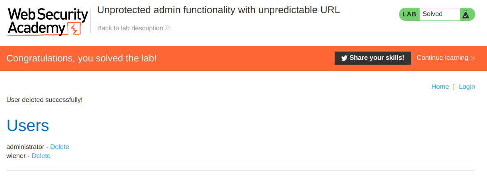
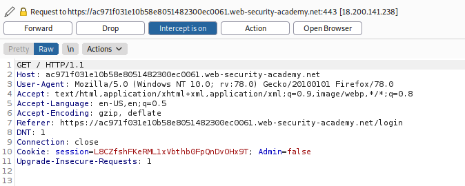
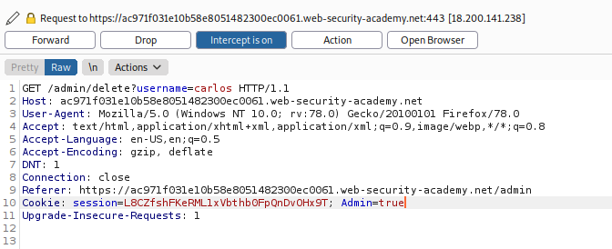
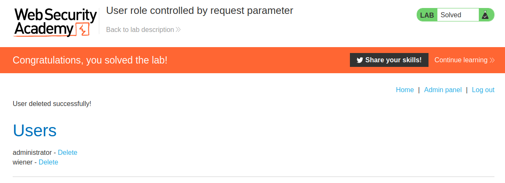
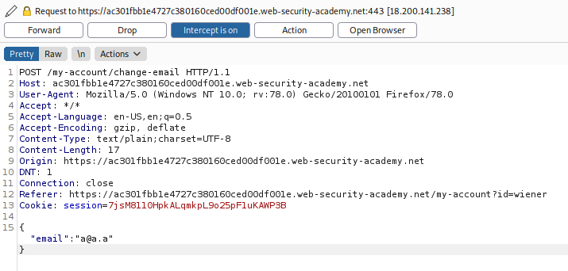

# Access control vulnerabilities - PortSwigger

Todos los laboratorios posteriormente expuestos los puedes encontrar para resolverlos en el siguiente link.

[https://portswigger.net/web-security/access-control](https://portswigger.net/web-security/access-control)

## Índice


## 1. Lab: Unprotected admin functionality

```
Este laboratorio tiene un panel de administración desprotegido.

Resuelva el laboratorio eliminando el usuario carlos.
```

Entonces accedemos al sitio web y colocamos la ruta del fichero **robots.txt** y nos retorna el siguiente contenido:


Entonces vamos a la nueva ruta donde nos aparecerá el panel de administracion.


Ahora eliminamos a carlos y completamos el laboratorio.


## 2. Lab: Unprotected admin functionality with unpredictable URL

```
Este laboratorio tiene un panel de administración desprotegido. Está ubicado en una ubicación impredecible, pero la ubicación se revela en algún lugar de la aplicación.

Resuelva el laboratorio accediendo al panel de administración y utilizándolo para eliminar al usuario carlos.
```

Revisando el codigo fuente del laboratorio nos topamos con el siguiente codigo en JS.

```html
<script>
var isAdmin = false;
if (isAdmin) {
   var topLinksTag = document.getElementsByClassName("top-links")[0];
   var adminPanelTag = document.createElement('a');
   adminPanelTag.setAttribute('href', '/admin-lplp1v');
   adminPanelTag.innerText = 'Admin panel';
   topLinksTag.append(adminPanelTag);
   var pTag = document.createElement('p');
   pTag.innerText = '|';
   topLinksTag.appendChild(pTag);
}
</script>
```

Entonces con esto llegamos a la conclusion que existe un recurso con el nombre

```
/admin-lplp1v
```

As'que accedemos a el mediante la URL.


Ahora eliminamos a carlos y completamos el laboratorio.



## 3. Lab: User role controlled by request parameter

```
Este laboratorio tiene un panel de administración en /admin, que identifica a los administradores mediante una cookie falsificable.

Resuelva el laboratorio accediendo al panel de administración y utilizándolo para eliminar al usuario carlos.

Tiene una cuenta en la aplicación que puede usar para ayudar a diseñar su ataque. Las credenciales son: wiener:peter.
```

Ingresamos al laboratorio y no logeamos con las credenciales que nos dan, interceptando todo en primer plano con la herramienta de proxy de burpsuite. En el segundo paquete interceptado nos encontramos con lo siguiente:



Podemos ver una cookie llamada **Admin** la cual tiene el valor de **false**, entonces lo que haremos será cambiar este valor por **true** y hacer clic en **Forward**.


Así que como podemos ver, nos reconoce como usuario administrador, ahora vamos al panel y eliminamos al usuario carlos para completar el laboratorio.



Cambiando de manera continua el valor de la cookie siempre que esté en false.



## 4. Lab: User role can be modified in user profile

```
Este laboratorio tiene un panel de administración en /admin. Solo es accesible para usuarios registrados con un roleid igual a 2.

Resuelva el laboratorio accediendo al panel de administración y utilizándolo para eliminar al usuario carlos.

Puede iniciar sesión en su propia cuenta utilizando wiener:peter.
```

Entonces nos logeamos, vamos a la seccion de **My account** y luego cambiamos el correo, pero interceptamos el paquete.



Como podemos ver, el email se envia en formato JSON, entonces supondremos que podemos enviarle mas datos, asi que insertaremos un parametro **roleid** con un valor de **2**.


Y como podemos ver, ya nos verifica como un usuario administrador.


Entonces, ahora accedemos al panel de administracion y eliminamos al usuario carlos.


## 5. Lab: URL-based access control can be circumvented

