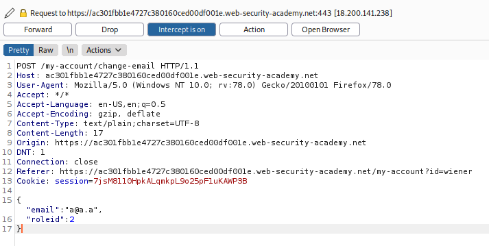
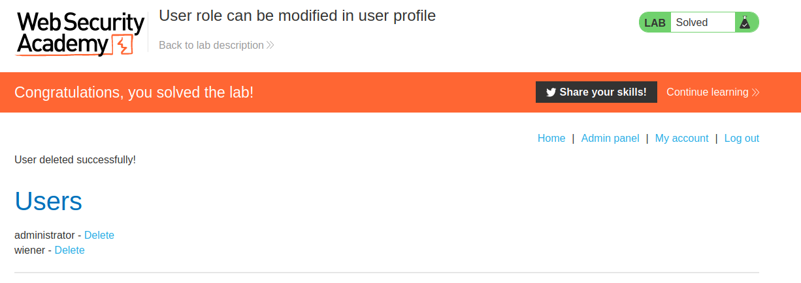
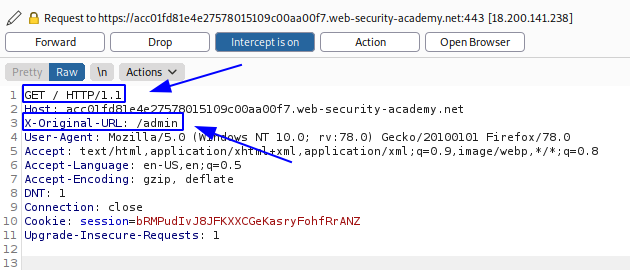
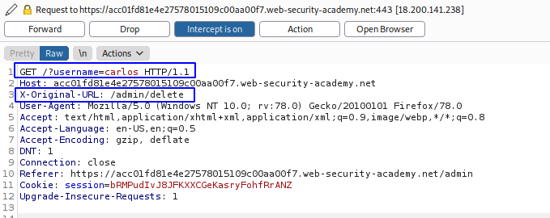
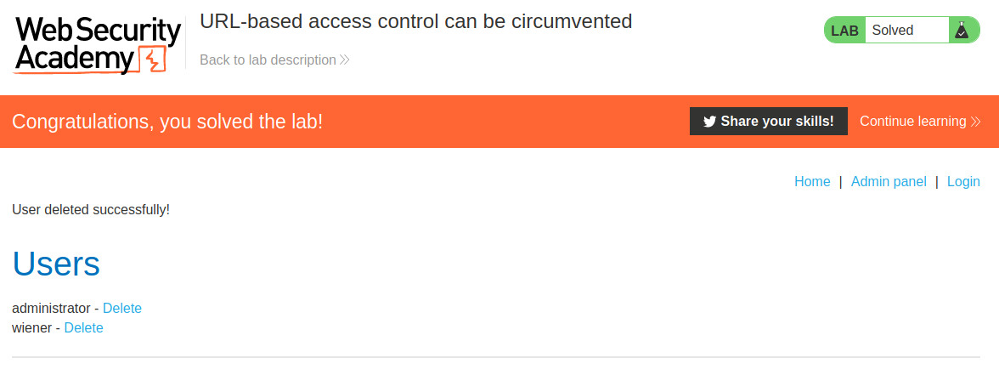
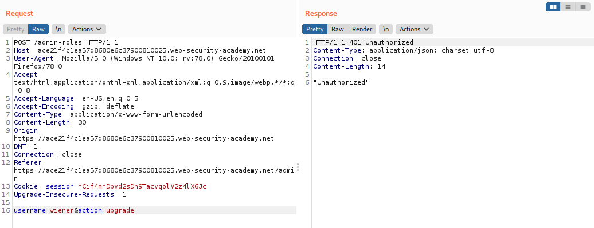
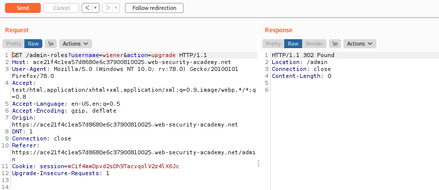
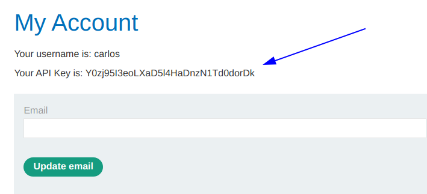
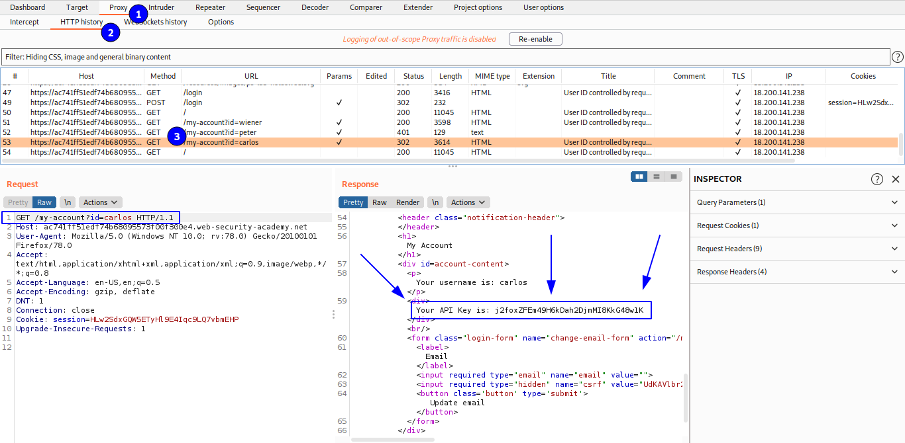

# Access control vulnerabilities - PortSwigger

Todos los laboratorios posteriormente expuestos los puedes encontrar para resolverlos en el siguiente link.

[https://portswigger.net/web-security/access-control](https://portswigger.net/web-security/access-control)

## Índice


## 1. Lab: Unprotected admin functionality

```
Este laboratorio tiene un panel de administración desprotegido.

Resuelva el laboratorio eliminando el usuario carlos.
```

Entonces accedemos al sitio web y colocamos la ruta del fichero **robots.txt** y nos retorna el siguiente contenido:


Entonces vamos a la nueva ruta donde nos aparecerá el panel de administracion.


Ahora eliminamos a carlos y completamos el laboratorio.


## 2. Lab: Unprotected admin functionality with unpredictable URL

```
Este laboratorio tiene un panel de administración desprotegido. Está ubicado en una ubicación impredecible, pero la ubicación se revela en algún lugar de la aplicación.

Resuelva el laboratorio accediendo al panel de administración y utilizándolo para eliminar al usuario carlos.
```

Revisando el codigo fuente del laboratorio nos topamos con el siguiente codigo en JS.

```html
<script>
var isAdmin = false;
if (isAdmin) {
   var topLinksTag = document.getElementsByClassName("top-links")[0];
   var adminPanelTag = document.createElement('a');
   adminPanelTag.setAttribute('href', '/admin-lplp1v');
   adminPanelTag.innerText = 'Admin panel';
   topLinksTag.append(adminPanelTag);
   var pTag = document.createElement('p');
   pTag.innerText = '|';
   topLinksTag.appendChild(pTag);
}
</script>
```

Entonces con esto llegamos a la conclusion que existe un recurso con el nombre

```
/admin-lplp1v
```

As'que accedemos a el mediante la URL.


Ahora eliminamos a carlos y completamos el laboratorio.


## 3. Lab: User role controlled by request parameter

```
Este laboratorio tiene un panel de administración en /admin, que identifica a los administradores mediante una cookie falsificable.

Resuelva el laboratorio accediendo al panel de administración y utilizándolo para eliminar al usuario carlos.

Tiene una cuenta en la aplicación que puede usar para ayudar a diseñar su ataque. Las credenciales son: wiener:peter.
```

Ingresamos al laboratorio y no logeamos con las credenciales que nos dan, interceptando todo en primer plano con la herramienta de proxy de burpsuite. En el segundo paquete interceptado nos encontramos con lo siguiente:


Podemos ver una cookie llamada **Admin** la cual tiene el valor de **false**, entonces lo que haremos será cambiar este valor por **true** y hacer clic en **Forward**.


Así que como podemos ver, nos reconoce como usuario administrador, ahora vamos al panel y eliminamos al usuario carlos para completar el laboratorio.


Cambiando de manera continua el valor de la cookie siempre que esté en false.


## 4. Lab: User role can be modified in user profile

```
Este laboratorio tiene un panel de administración en /admin. Solo es accesible para usuarios registrados con un roleid igual a 2.

Resuelva el laboratorio accediendo al panel de administración y utilizándolo para eliminar al usuario carlos.

Puede iniciar sesión en su propia cuenta utilizando wiener:peter.
```

Entonces nos logeamos, vamos a la seccion de **My account** y luego cambiamos el correo, pero interceptamos el paquete.


Como podemos ver, el email se envia en formato JSON, entonces supondremos que podemos enviarle mas datos, asi que insertaremos un parametro **roleid** con un valor de **2**.



Y como podemos ver, ya nos verifica como un usuario administrador.


Entonces, ahora accedemos al panel de administracion y eliminamos al usuario carlos.



## 5. Lab: URL-based access control can be circumvented

```
Este sitio web tiene un panel de administración no autenticado en /admin, pero se ha configurado un sistema de front-end para bloquear el acceso externo a esa ruta. Sin embargo, la aplicación de back-end se basa en un marco que admite el encabezado X-Original-URL.

Para resolver el laboratorio, acceda al panel de administración y elimine al usuario carlos.
```

Ingresamos al laboratorio e intentamos acceder al recurso /admin y nos sale el siguiente error.


Ahora interceptamos el paquete y le agregamos las configuraciones para el encabezado X-Original-URL.



 Y como podemos ver si nos muestra el panel de administracion.


Ahora eliminamos al usuario carlos y completamos el laboratorio. No olvidar realizar las mismas configuraciones de la encabezado para el siguiente paquete.



Colocando los parametro en la en el primer encabezado, pero los recursos en el encabezado **X-Original-URL**.



## 6. Lab: Method-based access control can be circumvented

```
Este laboratorio implementa controles de acceso basados ​​en parte en el método HTTP de solicitudes. Puede familiarizarse con el panel de administración iniciando sesión con administrator:admin.

Para resolver el laboratorio, inicie sesión utilizando wiener:peter y aproveche los controles de acceso defectuosos para promocionarse y convertirse en administrador.
```

Accedemos al laboratorio con la cuenta del administrador e interceptamos el paquete HTTP request que genera al convertir al usuario **carlos** en admin y lo enviamos al repeater.

```
POST /admin-roles HTTP/1.1
Host: ace21f4c1ea57d8680e6c37900810025.web-security-academy.net
User-Agent: Mozilla/5.0 (Windows NT 10.0; rv:78.0) Gecko/20100101 Firefox/78.0
Accept: text/html,application/xhtml+xml,application/xml;q=0.9,image/webp,*/*;q=0.8
Accept-Language: en-US,en;q=0.5
Accept-Encoding: gzip, deflate
Content-Type: application/x-www-form-urlencoded
Content-Length: 30
Origin: https://ace21f4c1ea57d8680e6c37900810025.web-security-academy.net
DNT: 1
Connection: close
Referer: https://ace21f4c1ea57d8680e6c37900810025.web-security-academy.net/admin
Cookie: session=J6CrF7hou8LPDDov83TPBJeKxGNCOkaW
Upgrade-Insecure-Requests: 1

username=carlos&action=upgrade
```

Ahora, lo que haremos será cerrar sesion y logearnos con nuestras credenciales **wiener:peter** y obtener nuestra cookie de usuario.

```
Cookie: session=mCif4mmDpvd2sDh9TacvqolV2z4lX6Jc
```

Ahora lo que haremos será ir al repeater, y cambiar los valores de la cookie por la nuestra y el usuaro **carlos** por **wiener** , luego enviamos.



Podemos ver que no nos permite acceder al recurso, ahora intentaremos con otro metodo que podría ser **GET**, para esto lo que ahoremos será en el repeater, clic derecho y luego en **Change request method**.



Y vemos que no lo permite, ahora solo vamos a la web desde el navegador para verificar que completamos el laboratorio.


## 7. Lab: User ID controlled by request parameter

```
Este laboratorio tiene una vulnerabilidad de escalamiento de privilegios horizontal en la página My account.

Para resolver el laboratorio, obtenga la API key para el usuario carlosy envíelo como la solución.

Puede acceder a su propia cuenta utilizando wiener:peter.
```

Nos logeamos en el laboratorio, y vamos a la seccion My account, y vemos que en la url nos sale lo siguiente:

```
https://ac9c1f461f644de98050b22a00a30024.web-security-academy.net/my-account?id=wiener
```

Entonces, lo que podemos intentar es cambiar **wiener** por **carlos**.

Entonces nos devuelve la informacion deseada:

```
Your username is: carlos

Your API Key is: iorkHspsZHINOI7Rn5a0PGofxxm8HVnQ
```

Ahora lo que haremos será enviar la **API Key** para completar el laboratorio.


## 8. Lab: User ID controlled by request parameter, with unpredictable user IDs

```
Este laboratorio tiene una vulnerabilidad de escalamiento de privilegios horizontal en la página My account, pero identifica a los usuarios con GUID.

Para resolver el laboratorio, busque el GUID de carlos y luego envíe su API key como solución.

Puede acceder a su propia cuenta utilizando wiener:peter.
```

Nos logeamos en el laboratorio, y vamos a la seccion My account, y vemos que en la url nos sale lo siguiente:

```
https://ac381f771edcd015804d58a7007700c8.web-security-academy.net/my-account?id=0b6ac053-6d12-44b7-9bb1-cd7d78129c0e
```

Así que necesitamos saber el GUID de el usuario **carlos**, podemos buscar algún indicio que mencione al usuario para verificar si hay informacion por ahí. Podemos ver que los post tienen autores, así que buscamos un post que tenga como autor a **carlos**.


Ahora lo que haremos será hacerle clic y podemos ver que nos lleva a una lista de post, publicados por carlos y podemos ver que en la url tenemos lo siguiente:

```
https://ac381f771edcd015804d58a7007700c8.web-security-academy.net/blogs?userId=034fd09a-600e-4308-9623-b8fae835cfa5
```

Entonces podemos suponer que el GUID de carlos es **034fd09a-600e-4308-9623-b8fae835cfa5**.

Ahora cambiamos el valor de GUID de **wiener** por el de **carlos**  en **My account** y obtenemos al API key.



Entonces copiamos la API key y la enviamos para completar el laboratorio.


## 9. Lab: User ID controlled by request parameter with data leakage in redirect

```
Este laboratorio contiene una vulnerabilidad de control de acceso en la que se filtra información confidencial en el cuerpo de una respuesta de redireccionamiento.

Para resolver el laboratorio, obtenga la clave API para el usuario carlos y envíelo como la solución.

Puede acceder a su propia cuenta utilizando wiener:peter.
```

Accedemos al laboratorio, nos logeamos y luego accedemos a **My account**. Podemos ver que en la url está el nombre de **wiener**. Entonces ahora prendemos el burpsuite, para que filtre los paquetes en segundo plano y cambiarmos el nombre de **wiener** por **carlos** y vemos como nos redirige al **Home**. Luego buscamos el request enel **http history** de la ventana **proxy**.



Entonces copiamos la API key y la enviamos para completar el laboratorio.


## 10. Lab: User ID controlled by request parameter with password disclosure


