# Business logic vulnerabilities - PortSwigger

Todos los laboratorios posteriormente expuestos los puedes encontrar para resolverlos en el siguiente link.

[https://portswigger.net/web-security/logic-flaws](https://portswigger.net/web-security/logic-flaws)

## Índice


## 1. Lab: Excessive trust in client-side controls

```bash
Esta práctica de laboratorio no valida adecuadamente la entrada del usuario. Puede aprovechar una falla lógica en su flujo de trabajo de compras para comprar artículos por un precio no deseado. Para resolver el laboratorio, compre una "Lightweight l33t leather jacket".

Puede acceder a su propia cuenta con las siguientes credenciales: wiener:peter
```

Ahora lo que haremos será hacer clic es el producto que deseamos comprar.

**NOTA: NO SE OLVIDE QUE DEBE INICIAR CON SU CUENTA**


Y ahora intercpetaremos el paquete al hacer clic en **Add to cart**.

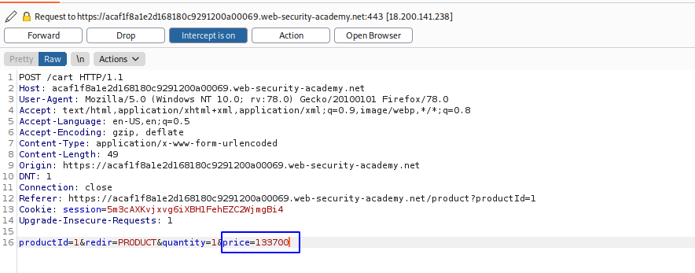

Como podemos ver, nos encontramos con un parametro llamado **price**, entonces nos da la idea de poder cambiar el valor del producto antes de generar la compra.

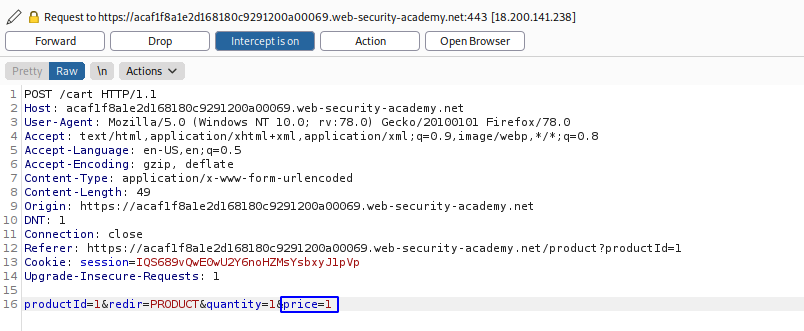

Luego vamos a la seccion del carrito y le damos clic en **Place Order**.


Y luego podemos ver que se completó satisfactoriamente el laboratorio.

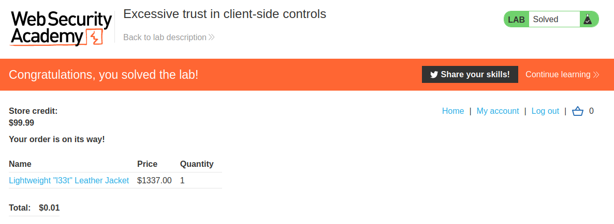

## 2. Lab: High-level logic vulnerability

 ```
Esta práctica de laboratorio no valida adecuadamente la entrada del usuario. Puede aprovechar una falla lógica en su flujo de trabajo de compras para comprar artículos por un precio no deseado. Para resolver el laboratorio, compre una "Lightweight l33t leather jacket".

Puede acceder a su propia cuenta con las siguientes credenciales: wiener:peter
 ```

Ahora lo que haremos será hacer clic es el producto que deseamos comprar.

**NOTA: NO SE OLVIDE QUE DEBE INICIAR CON SU CUENTA**


Y ahora intercpetaremos el paquete al hacer clic en **Add to cart**.


Como podemos ver, el parametro **quantity** tiene valor de 1, intentaremos actualizar su valor a **-1**.


Ahora, lo enviamos el paquete, y revisamos la respuesta.

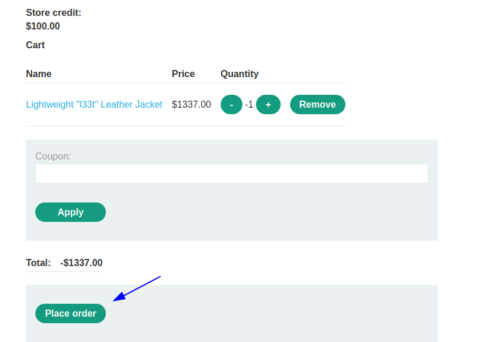

Como podemos ver, nos va a costar la compra el modico precio de: **-1337** (LOL), entonces le damos clic en **Place order**

, 

Con la misma logica, vamos a realizar la siguiente configuracion.


Y como vemos logramos completar el laboratorio.

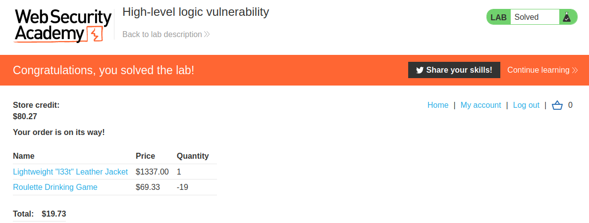

## 3. Lab: Low-level logic flaw

```bash
Esta práctica de laboratorio no valida adecuadamente la entrada del usuario. Puede aprovechar una falla lógica en su flujo de trabajo de compras para comprar artículos por un precio no deseado. Para resolver el laboratorio, compre una "Lightweight l33t leather jacket".

Puede acceder a su propia cuenta con las siguientes credenciales: wiener:peter
```

Ahora lo que haremos será hacer clic es el producto que deseamos comprar.

**NOTA: NO SE OLVIDE QUE DEBE INICIAR CON SU CUENTA**


Y ahora intercpetaremos el paquete al hacer clic en **Add to cart**.


Enviamos el valor **-1** en el parametro **quantity**, pero no nos permite. 

Sabemos que un **integer** esta compuesto por 32 bits. Entonces una variable entera está en el rango de: **[ -2147483648 : 2147483647 ]**.

Como sabemos que el precio del producto es **1337**, entonces resolvemos al siguiente ecuacion.

```python
>>> (2147483647*2.0)/133700
32123.913941660434
```

Entonces, sabemos que, tenemos que reptir 32123 veces el producto, y como maximo solo podemos agregar 99 en una consulta.

```python
>>> 32123.0/99
324.47474747474746
```

Ahora enviamos el paquete anterior al intruder y seteamos la siguientes configuraciones.

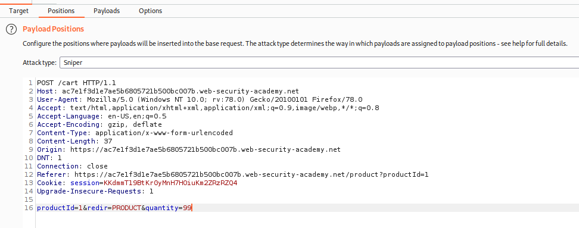

En la parte de la cantidad d payloads especificamos 323, porque el intruder cuenta desde 0.


Y luego de damos en **Start Attack**.

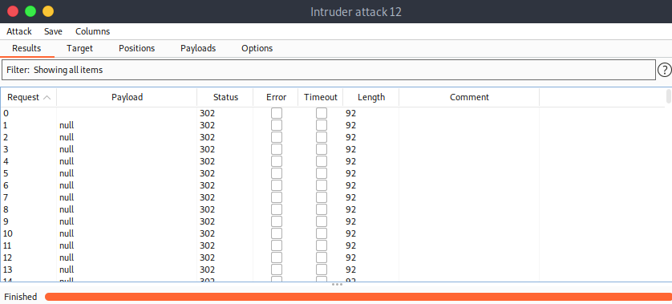

Ahora vamos al carrito, a ver como quedó los resultados.

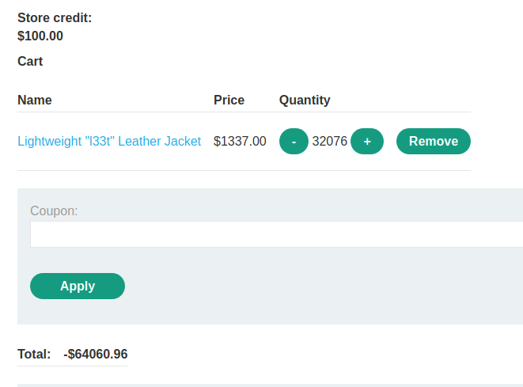

Entonces viendo cuandos mas nos falta, hacemos el siguiente calculo.

```python
>>> 6406096/133700
47
```

Entonces compramos 47 unidades manualmente del producto y tendríamos el siguiente resultado.

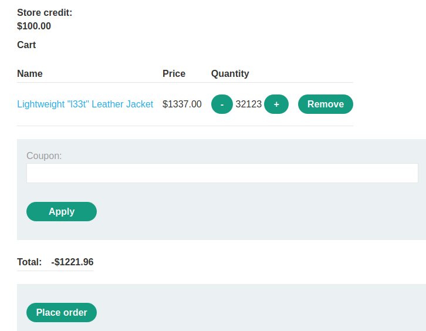

Como solo tenemos 100 de balance, no podemos exceder ese dinero, por ello que ya no podemos comprar mas productos de ese tipo. Por ello buscaremos un candidato que nos ayude a alcanzar el numero deceado. Elejiremos el producto **Giant Grasshopper** cuyo precio es: **71.20**, entonces:

```python
>>> 122196.0/7120
17.1623595505618
```

Entonces agregaremos 17 unidades del articulo **Giant Grasshopper**. El resultado sería el siguiente:

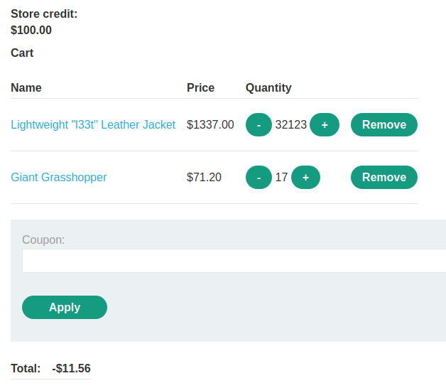

Entonces como podemos ver, todavia no llevamos a numeros positivos, así que agregamos 1 unidad mas a **Giant Grasshopper**.


Ahora si le damos clic en **Place Order**.

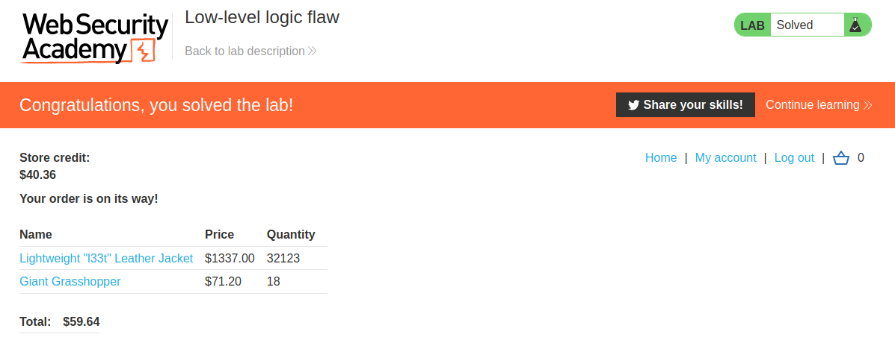

## 4. Lab: Inconsistent handling of exceptional input

```bash
Esta práctica de laboratorio no valida adecuadamente la entrada del usuario. Puede aprovechar una falla lógica en el proceso de registro de su cuenta para obtener acceso a la funcionalidad administrativa. Para resolver el laboratorio, acceda al panel de administración y elimine a Carlos
```

Intentaremos registrarnos usando un correo muy largo, para ver si ocurre algun caso excepcional con respecto al input.

```bash
AAAAAAAAAAAAAAAAAAAAAAAAAAAAAAAAAAAAAAAAAAAAAAAAAAAAAAAAAAAAAAAAAAAAAAAAAAAAAAAAAAAAAAAAAAAAAAAAAAAAAAAAAAAAAAAAAAAAAAAAAAAAAAAAAAAAAAAAAAAAAAAAAAAAAAAAAAAAAAAAAAAAAAAAAAAAAAAAAAAAAAAAAAAAAAAAAAAAAAAA@acd61f861ec39ef080ab06a901cf0050.web-security-academy.net
```


Nos da la siguiente respuesta:

```
Please check your emails for your account registration link
```

Entonces activamos la cuenta y vamos a la seccion **My Account**

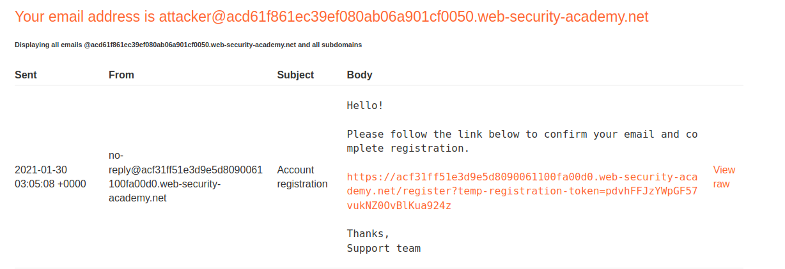

Como podemos ver, cualquier correo que pongamos llegará al **email client** sin inportar que no sea el correo especificado ahí.

Ahora nos logeamos con nuestra cuenta creada luego de darle clic al enlace.


Como podemos ver, el correo se trunca ante una logitud. Lo que haremos será obtener la cantidad de caracteres donde se trunca el correo.

```python
>>> len("AAAAAAAAAAAAAAAAAAAAAAAAAAAAAAAAAAAAAAAAAAAAAAAAAAAAAAAAAAAAAAAAAAAAAAAAAAAAAAAAAAAAAAAAAAAAAAAAAAAAAAAAAAAAAAAAAAAAAAAAAAAAAAAAAAAAAAAAAAAAAAAAAAAAAAAAAAAAAAAAAAAAAAAAAAAAAAAAAAAAAAAAAAAAAAAAAAAAAAAA@acd61f861ec39ef080ab06a901cf0050.web-security-academy.")
255
```

Entonces pensaremos en un payload que al cortarse pueda truncarse y obtener el correo que deseamos.

```bash
textoo....oooo@dontwannacry.com.acd61f861ec39ef080ab06a901cf0050.web-security-academy.net
```

Ahora, entramos a un posible directorio llamado **admin** y nos dice que solo pueden ingresar los usuarios **DontWannaCry**.


Entonces, calculamos la longiutd del correo **@dontwannacry.com** y lo que resta lo rellenamos de **A**.

```python
>>> 255-len("@dontwannacry.com")
238
>>> print "A"*238
AAAAAAAAAAAAAAAAAAAAAAAAAAAAAAAAAAAAAAAAAAAAAAAAAAAAAAAAAAAAAAAAAAAAAAAAAAAAAAAAAAAAAAAAAAAAAAAAAAAAAAAAAAAAAAAAAAAAAAAAAAAAAAAAAAAAAAAAAAAAAAAAAAAAAAAAAAAAAAAAAAAAAAAAAAAAAAAAAAAAAAAAAAAAAAAAAAAAAAAAAAAAAAAAAAAAAAAAAAAAAAAAAAAAAAAAAAAAAA
```

Nuestro payload sería pero debemos agregarle la finalidad **.acd61f861ec39ef080ab06a901cf0050.web-security-academy.net**.

```bash
AAAAAAAAAAAAAAAAAAAAAAAAAAAAAAAAAAAAAAAAAAAAAAAAAAAAAAAAAAAAAAAAAAAAAAAAAAAAAAAAAAAAAAAAAAAAAAAAAAAAAAAAAAAAAAAAAAAAAAAAAAAAAAAAAAAAAAAAAAAAAAAAAAAAAAAAAAAAAAAAAAAAAAAAAAAAAAAAAAAAAAAAAAAAAAAAAAAAAAAAAAAAAAAAAAAAAAAAAAAAAAAAAAAAAAAAAAAAAA@dontwannacry.com.acd61f861ec39ef080ab06a901cf0050.web-security-academy.net
```

Ahora nos registrmos con el payload como correo.


Y luego de activar la cuenta, ingresamos y vamos a la seccion de **My Account**.

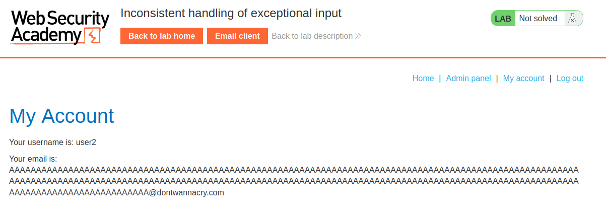

Y como podemos ver, tenemos disponible el panel del **Admin**.

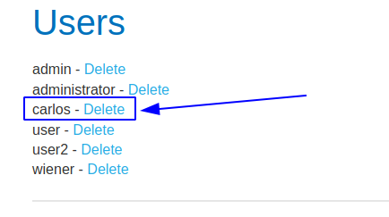

Nuestra mision es matar al usuario **carlos**.


Y logramos solucionar el laboratorio.

## 5. Lab: Inconsistent security controls

