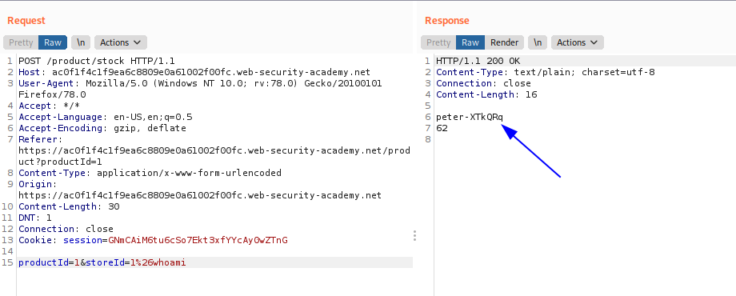
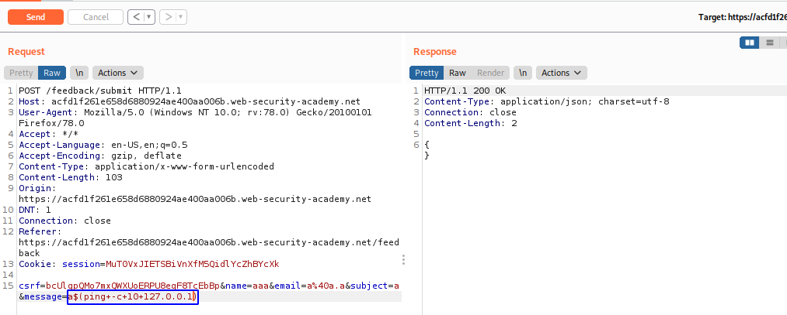

# OS command injection

Todos los laboratorios posteriormente expuestos los puedes encontrar para resolverlos en la academia de PortSwigger.

[https://portswigger.net/web-security/os-command-injection](https://portswigger.net/web-security/os-command-injection)

## Indice


## 1. Lab: OS command injection, simple case

```text
Esta práctica de laboratorio contiene una vulnerabilidad de inyección de comandos del sistema operativo en el verificador de stock de productos.

La aplicación ejecuta un comando de shell que contiene los ID de tienda y producto proporcionados por el usuario, y devuelve la salida sin procesar del comando en su respuesta.

Para resolver la práctica de laboratorio, ejecute el whoamicomando para determinar el nombre del usuario actual.
```

Como nos dice la informacion, buscaremos un articulo cualquiera, y le damos clic en el boton **Check stock** y lo interceptamos con el burpsuite y lo enviamos al **Repeater**.


Como podemos ver, todo ocurre de manera normal, ahora intentaremos ejecutar comandos agregandole **& whoami**.


Si lo enviamos así no va a obtener nada, ya que el **&** lo esta considerando como el cierre del parametro y el inicio de otro asi que lo que haremos será seleccion todo el parametro **1&whoami** y encodearlo con las teclas **Ctrl + U**.



Como podemos ver, si ejecutó el comando **whoami**, y si vamos a el sitio web, nos damos cuenta que si figura como resuelto.


## 2. Lab: Blind OS command injection with time delays

```bash
Esta práctica de laboratorio contiene una vulnerabilidad de inyección ciega de comandos del SO en la función de retroalimentación.

La aplicación ejecuta un comando de shell que contiene los detalles proporcionados por el usuario. La salida del comando no se devuelve en la respuesta.

Para resolver el laboratorio, aproveche la vulnerabilidad de inyección ciega de comandos del sistema operativo para provocar un retraso de 10 segundos.
```

Lo que haremos será enviar un feedback al webmaster mediante la opcion que aparece en el sitio web.


E interceptamos el paquete con burpsuite y lo enviamos al reapiter.


Como podemos ver, no obtener ninguna respuesta al realizar el comando, ahora intentaremos generar un retardo en la solicitud agregandole un **ping -c 10 127.0.0.1**.



Lo cual logró generar el retrazo, ya que generamos el comando ping dentro de los caracteres **''$(''** y **'')'** que sirven para ejecutar strings dentro de strings.


## 3. Lab: Blind OS command injection with output redirection  