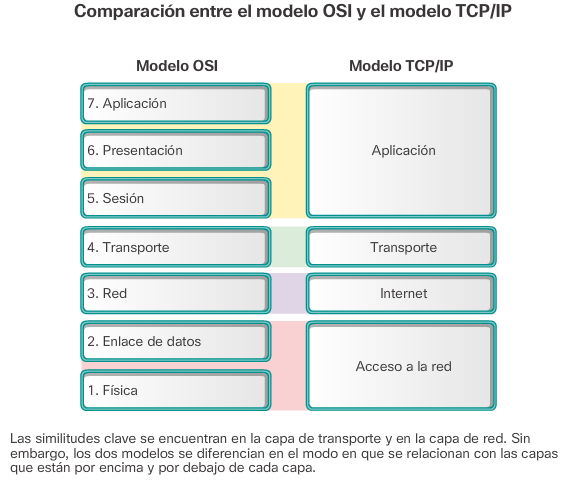

---

layout: default
title: "Un nuevo comienzo"
permalink: /how-to-start/
---

# Hola!, que tal?

Me llamo Desdes. Seria un honor para mi saber cual es tu nombre.

Mi nombre es:  <input name='name' type='text' onchange="document.getElementById('done').innerHTML = 'Un gusto!, desde hoy te llamare Marrano.'">

:)

------

Bueno, tal vez llegaste aqui porque no sabes como empezar en este mundo, y te entiendo. Puede que tengas interes en este mundo... pero, hay muchos temas o muchas ramas y no sabes por donde empezar. Esto es algo comun, asi que empezaremos desde los temas mas basicos y nos iremos complicando poco a poco. Entendido :D !

Tocaremos muchos temas, la mayoria tal vez las conozcas o tal vez no. Asi que si conoces algun tema que ya conoces simplemente saltatelo. Pero... si quieres reforzar tus ideas, te recomiendo que las revises.

Empezaremos con un tema muy basico, tal vez no muy facil, pero muy necesario. Este tema sera conceptos de redes. Esto se debe a que, los conceptos de redes son muy utiles para entender la mayoria de conceptos de seguridad informatica.

Supongo que ya has tenido algun contacto con la computacion. Bueno si no fuera asi no estaria aqui XD.

Bueno, los sitios webs son la cara mas conocida de la internet, podriamos hacer un 'zoom' a cada uno de las partes de una comunicacion entre usuario y sitio web y encontrariamos partes y partes de modelos de internet. Por ello empezaremos con lo mas basico y util cuando hablamos de conceptos de red. **El modelo OSI**.

## The OSI Model

Piensa en una calculadora, una simple, porque ahora hay calculadoras que hasta se conectan a internet.  Una calculadora simple y basica. Maneja informacion de manera interna, procesa las operaciones que le envias y te devuelve una respuesta. Esta calculadora es un sistema cerrado. Puesto que no se comunica con otras calculadora y menos con computadores. 

Ahora imaginemos 2 computadores. Estos computadores se comunican manejando un cierto 'lenguaje'.  Estos computadores son sistemas abiertos, puesto que se pueden comunicar entre ellos con el 'lenguaje' especificado anteriormente. El modelo OSI es justamente eso. Open System Interconection Model (Modelo de instercionexion de sistemas abierto). Entonces, el modelo OSI nos especifica la manera en como estos computadores se comunicaran. Luego, lo que llamamos 'lenguaje' llevara el nombre de **protocolo**.

Entonces, el **modelo OSI** consta de 7 capas:

* Aplicacion
* Presentacion
* Presentacion
* Transporte
* Red
* Enlace de Datos
* Fisica

Cada una de las capas tiene multiples protocolos, entonces. Como podemos definir un protocolo?, Un protocolo vendria a ser una serie de reglas para poder realizar una comunicacion entre dos elementos.

Te recomiendo investigar un poco mas sobre el modelo OSI, y sobre cada una de las capas. **:)**

## Modelo TCP/IP

El modelo TCP/IP se deriba del modelo OSI, muchas de sus capas colapsan entre ellas y ahora contamos con 4 capas, todas los demas conceptos son parecidos. Solo que, el modelo TCP/IP se centra en el **procolo IP** (Internet Protocol). Las  cuales son:

* Aplicacion
* Transporte
* Internet
* Acceso a la Red

Como podemos ver en la siguiente imagen:

Te recomiendo investigar un poco mas sobre el modelo TCP/IP, y sobre cada una de las capas. **:)**

## Protocolos

Ahora veremos algunos protocolos interesantes por cada una de las capas del modelo TCP/IP. **Te recomiendo que les des una breve revisada a cada uno de ellos, igual con el tiempo estaremos usando todos ellos, pero siempre es buena ya empezar a darle una revisada a cada uno de ellos :D**.

### Aplicacion

En la capa de aplicacion nos topamos con todos los protocolos mas conocidos, estos protocolos son los mas usados por los usuarios pues son los que se encuentran en el nivel mas alto **(consideremos la terminologia 'nivel mas alto' como si fuera el mar, el nivel mas alto seria lo que se ve desde afuera, mientras que los niveles mas bajos serian los que se encuentran en las profundidades)**. 

* HTTP: El protocolo mas conocido hasta por los que no saben nada de redes, Quien no ha visitado una web :D ?.
* HTTPS: Recuerdas el candadito que sale a veces cuando accedes a una web, pues tiene que ver con esto.
* SSH: Esto protocolo sirve para poder ejecutar comandos de sistema de otro computador.
* FTP: Este protocolo funciona para enviar archivos a un computador.
* SMB: Protocolo usado por Microsoft (Si, los de windows.) que permite compartir archivos, impresoras entre otros, en la misma red.
* DNS: Este de aqui es un protocolo interesante, pues gracias a este no tenemos que memorizar numeritos, sino palabras.
* SMTP: Protocolo necesario para los servidores de correo electronico.
* DHCP: Este protocolo te ayuda a darte una direccion IP cuando te conectas a una red, de esta manera no debes hacer manualmente.

Busca un poco de informacion sobre estos protocolos para que ya poco a poco tengas un conocimiento general sobre ellos. Si te interesa seguridad o redes, los vas a ver muy amenudo, aun hay muchos protocolos de la capa de aplicacion que no hemos visto, pero estos son los mas mencionados.

### Transporte

e.e

