# Server-side request forgery - PortSwigger

Todos los laboratorios posteriormente expuestos los puedes encontrar para resolverlos en el siguiente link.

[https://portswigger.net/web-security/ssrf](https://portswigger.net/web-security/ssrf)

## Índice


## 1. Lab: Basic SSRF against the local serve

```
Este laboratorio tiene una función de verificación de stock que obtiene datos de un sistema interno.

Para resolver el laboratorio, cambie la URL de verificación de existencias para acceder a la interfaz de administración http://localhost/admin y elimine al usuario carlos.
```

Entonces, lo que haremos será interceptar los paquetes en segundo plano y entrar a uno de los articulos.


Entonces buscamos el paquete que envio la solicutd de **Check stock**.

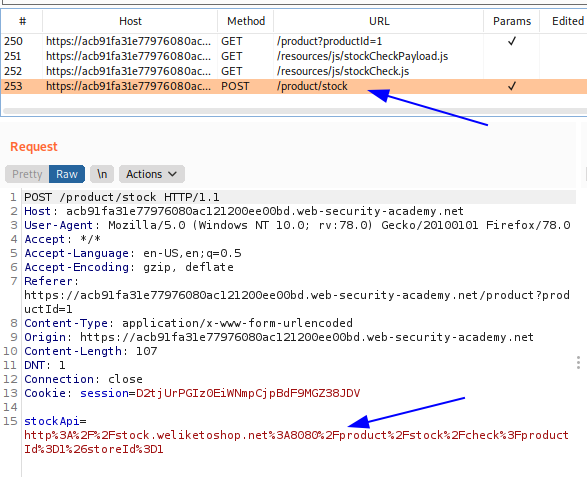

Así que lo enviamos al repeater, y a su vez desde el navegador intentamos dirigirnos a **/admin**, para visualizar la respuesta.


Como podemos ver se puede acceder con una cuenta de administrador, o tambien de manera local. Entonces en el paquete que enviamos al Repeater, editamos el parametro **stockApi** por **http://localhost/admin**.

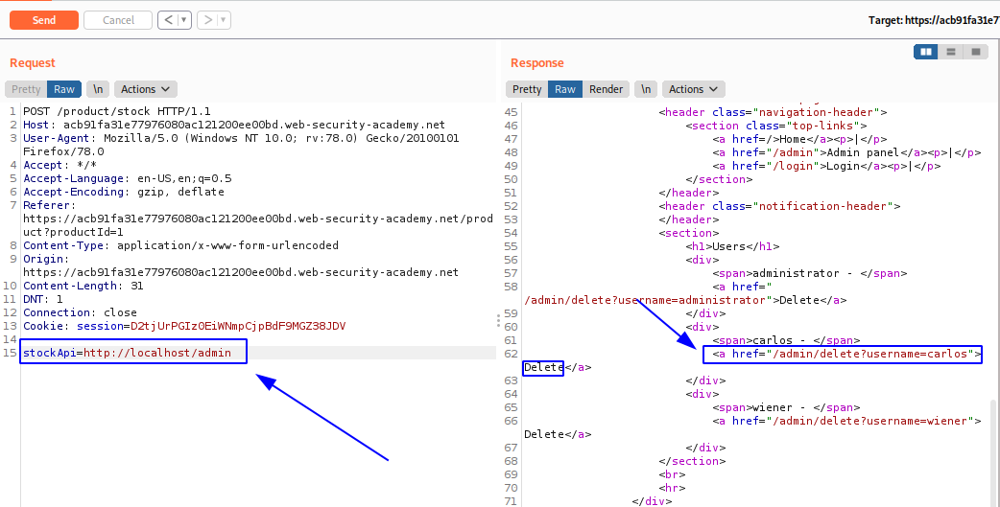

Y como podemos ver, funcionó la solicitud y a su vez nos envia un link donde podemos eliminar al usuario carlos, así que lo agregamos a nuestra solicitud y lo volvemos a enviar.

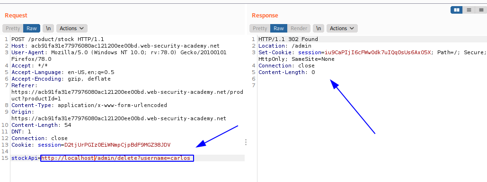

Lo cual parece que funcionó. Entonces nos dirigimos al home del laboratorio para verificar que completamos el laboratorio.


## 2. Lab: Basic SSRF against another back-end system

```
Este laboratorio tiene una función de verificación de existencias que obtiene datos de un sistema interno.

Para resolver el laboratorio, use la función de verificación de existencias para escanear el rango interno  192.168.0.X en busca de una interfaz de administración en el puerto 8080, luego úsela para eliminar el usuario carlos.
```

Entonces, lo que haremos será interceptar los paquetes en segundo plano y entrar a uno de los articulos y verificar el stock presente.


Ahora lo que haremos será enviarlo al Intruder, y entonces, hay que planear cual sería el payload que ingresariamos en **stockApi**, como nos hablan de un panel de administracion en el puerto 8080,

```
http://192.168.0.1:8080/admin
```

Entonces realizamos las siguientes configuraciones en el intruder.


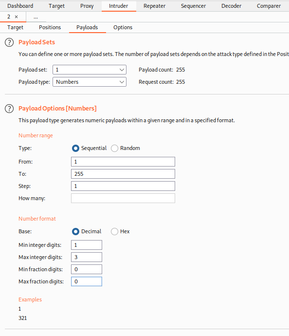

Y le damos en **Start Attack**.

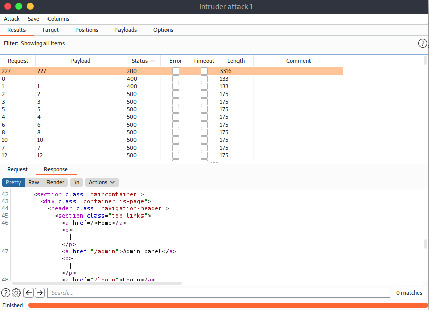

Entonces, encontramos que para el payload **227**, nos topamos con un panel de administracion. Entonces enviamos el paquete al repeater, y colocamos el enlace para eliminar a carlos y enviamos el paquete.

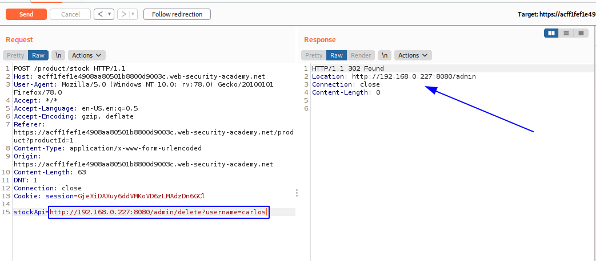

Ahora revisamos en el home del laboratorio para verificar que lo completamos.


## 3. Lab: SSRF with blacklist-based input filter

```
Este laboratorio tiene una función de verificación de existencias que obtiene datos de un sistema interno.

Para resolver el laboratorio, cambie la URL de verificación de existencias para acceder a la interfaz de administración http://localhost/admin y elimine al usuario carlos.

El desarrollador ha implementado dos defensas anti-SSRF débiles que deberá evitar.
```

Entonces, lo que haremos será interceptar los paquetes en segundo plano y entrar a uno de los articulos y verificar el stock presente.

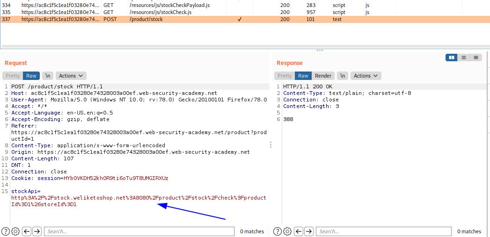

Así que ahora lo enviamos al repeater, e intentamos cargar el panel de administracion.


Entonces como podemos ver, nos bloquea la solicitud puesto que en su lista negra debe estar el string **127.0.0.1**, entonces lo vamos a reemplazar por **127.1**.

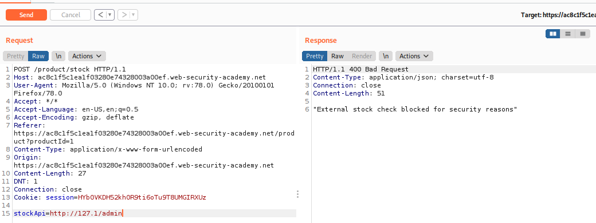

Como podemos ver, aun nos bloquea, y debe ser por que **admin** debe ser parte de la lista negra tambien, así que enviamos admin al decoder y aplicamos dos veces **encode URL**.


Y el resultado lo reemplazamos en el repeater, y enviamos el paquete.

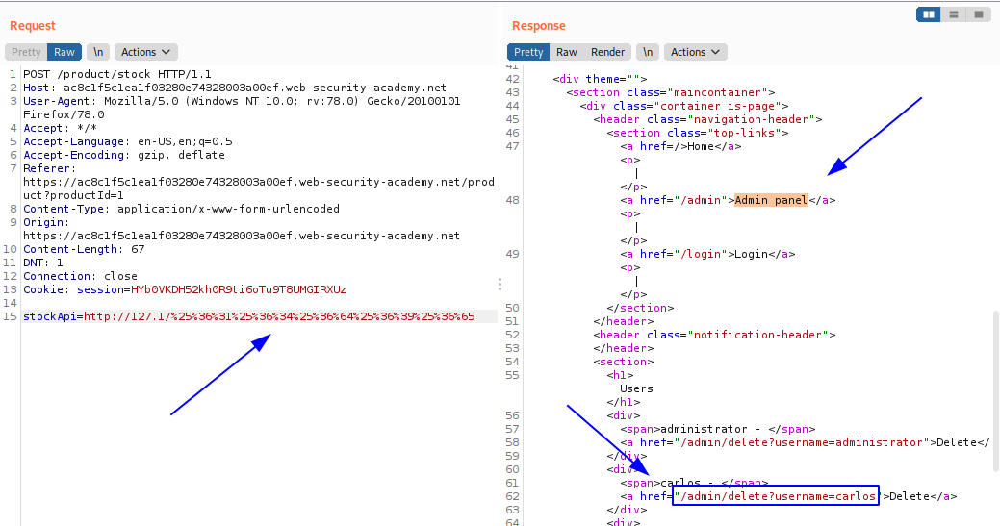

Entonces podemos ver que funcionó, ahora copiamos el recurso **/delete... ** y lo agregamo al parametro **stockApi** para eliminar al usuario **carlos**.

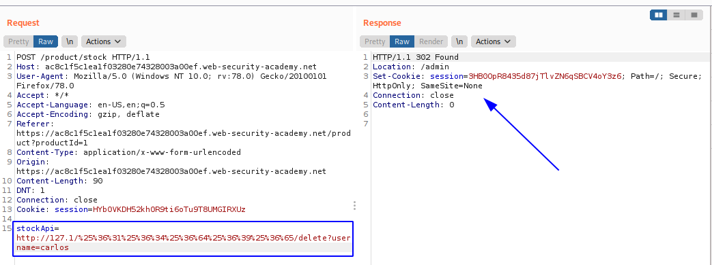

Entonces, funcionó el envio. Ahora accedemos al home del laboratorio para verificar que lo completamos.


## 4. Lab: SSRF with whitelist-based input filter

```
Este laboratorio tiene una función de verificación de stock que obtiene datos de un sistema interno.

Para resolver el laboratorio, cambie la URL de verificación de existencias para acceder a la interfaz de administración http://localhost/admin y elimine al usuario carlos.

El desarrollador ha implementado una defensa anti-SSRF que deberá omitir.
```

Entonces, lo que haremos será interceptar los paquetes en segundo plano y entrar a uno de los articulos y verificar el stock presente y luego lo enviamos al repeater y comprobamos el envio.

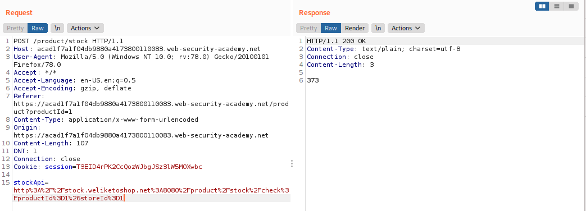

Ahora lo que haremos será intentar conectarnos a la url **http://localhost/admin**-

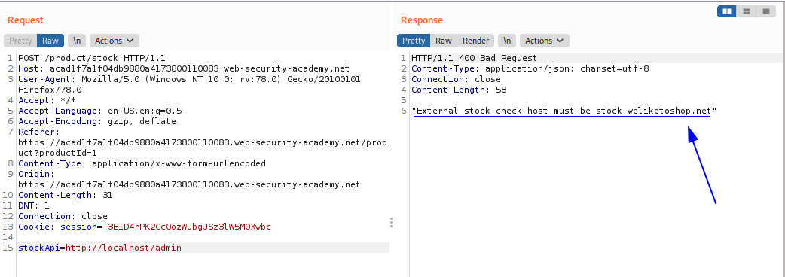

Entonces, podemos ver qie nos pide que la url contenga **stock.weliketoshop.net**. Entonces, intentaremos usando el truco del **@**.

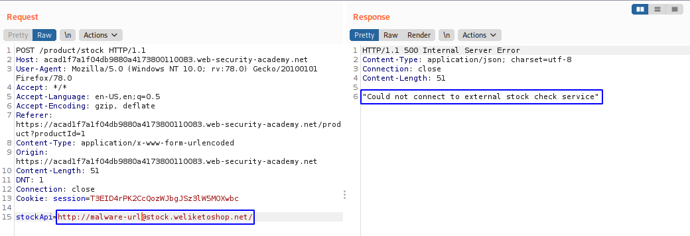

Como podemos ver funciona el **@**, ahora intentaremos reemplazar **malware-url** por **localhost**. y le agregamos un **#** luego de localhost y vemos lo que ocurre.

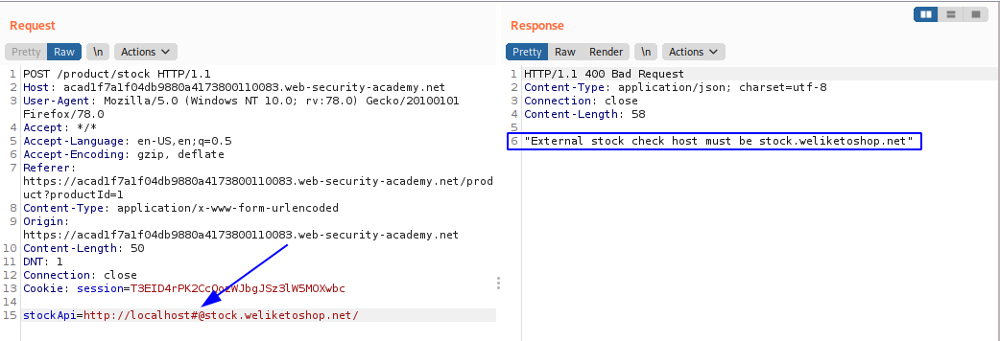

Entonces podemos ver que nos deniega la URL, entonces intentamos usar el mismo metodo que en el laboratorio anterior encodeando dos veces el simbolo **#**.


Entonces enviamos el siguiente payload.


Y vemos que si interpreta el payload, entonces enviamos el directorio de **/admin**.

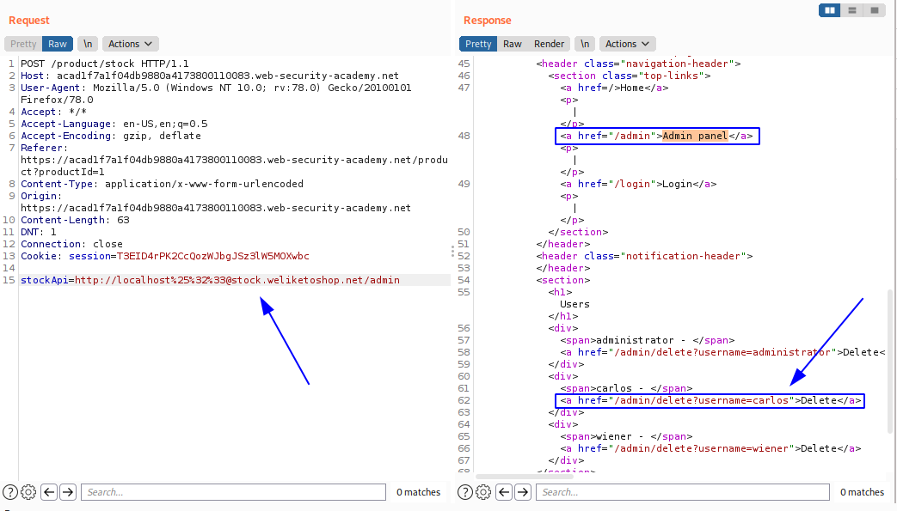

Entonces podemos ver que funcionó, ahora copiamos el recurso **/delete... ** y lo agregamo al parametro **stockApi** para eliminar al usuario **carlos**.

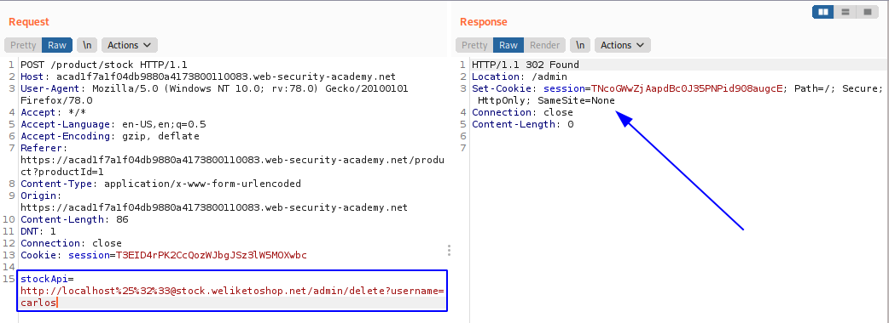

Entonces, funcionó el envio. Ahora accedemos al home del laboratorio para verificar que lo completamos.


## 5. Lab: SSRF with filter bypass via open redirection vulnerability

```
Este laboratorio tiene una función de verificación de existencias que obtiene datos de un sistema interno.

Para resolver el laboratorio, cambie la URL de verificación de existencias para acceder a la interfaz de administración http://192.168.0.12:8080/admin y elimine al usuario carlos.

El verificador de acciones se ha restringido para acceder solo a la aplicación local, por lo que primero deberá encontrar una redirección abierta que afecte a la aplicación.
```

Entonces, lo que haremos será interceptar los paquetes en segundo plano y entrar a uno de los articulos y verificar el stock presente y luego lo enviamos al repeater y comprobamos el envio.

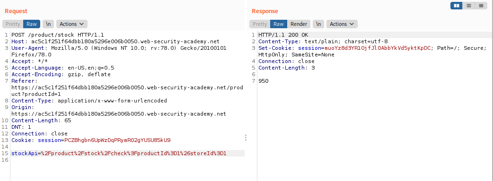

Ahora, vamos a la pagina del articulo y vemos un enlace el cual dice: **[Next product]** , y luego vemos en el HTTP History.

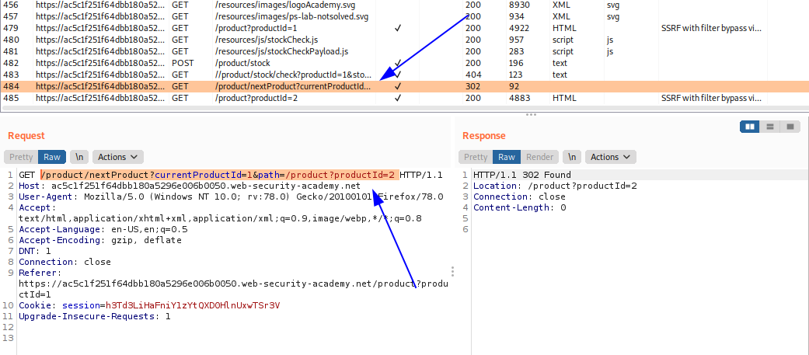

Entonces, tenemos los parametros post:

```
stockApi=%2Fproduct%2Fstock%2Fcheck%3FproductId%3D1%26storeId%3D1
```

Y en el paquete anterior, obtenemos el redirect en el parametro **path**.

```
/product/nextProduct?currentProductId=1&path=/product?productId=2
```

Agregamos nuestra url deseada **http://192.168.0.12:8080/admin**.

```
/product/nextProduct?currentProductId=1&path=http://192.168.0.12:8080/admin
```

Entonces codeamos nuestro payload en el encoder.


Lo actualizamos el parametro **stockApi** y enviamos el paquete.

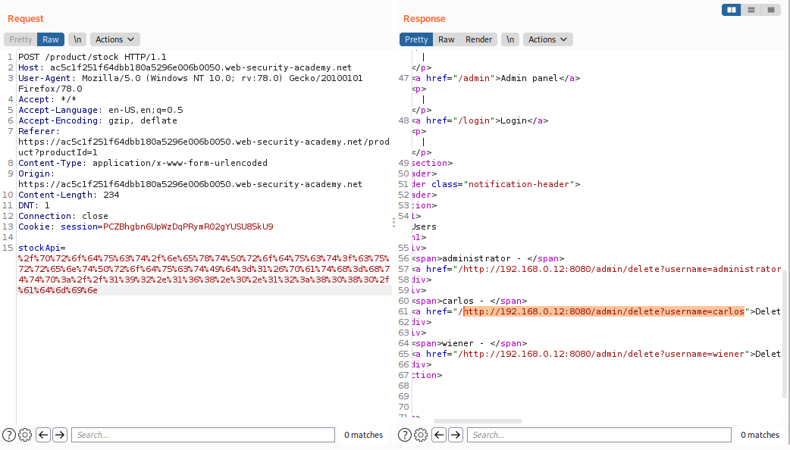

Y como vemos si envia el paquete, y carga el panel de administracion, entonces le agregamos el recurso **/delete?username=carlos**.


Entonces, enviamos el parametro para esperar la respuesta de que se eliminó el usuario satisfactoriamente.

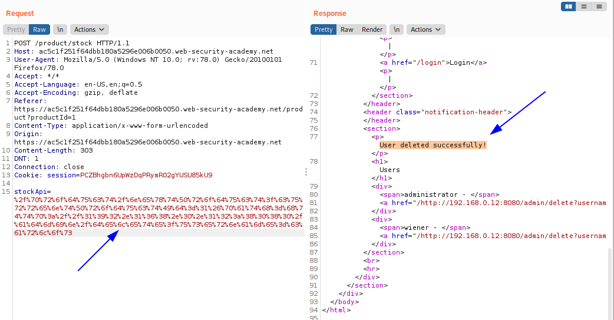

Entonces, funcionó el envio. Ahora accedemos al home del laboratorio para verificar que lo completamos.


## 6. Lab: Blind SSRF with out-of-band detection

