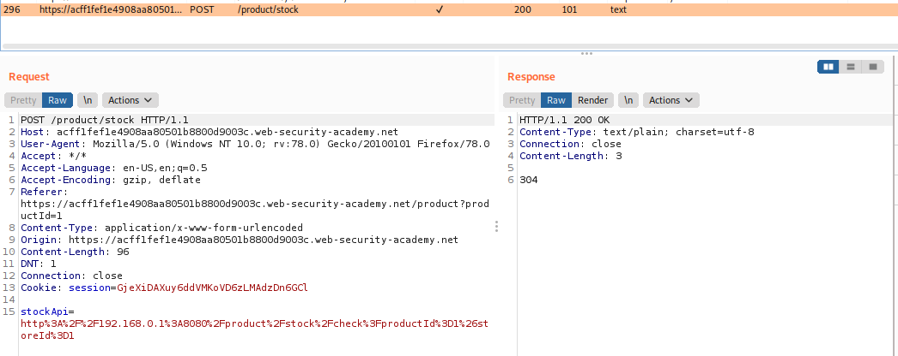
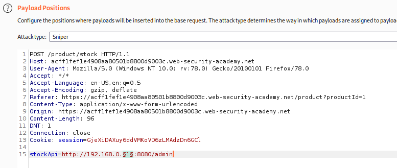

# Server-side request forgery - PortSwigger

Todos los laboratorios posteriormente expuestos los puedes encontrar para resolverlos en el siguiente link.

[https://portswigger.net/web-security/ssrf](https://portswigger.net/web-security/ssrf)

## Índice


## 1. Lab: Basic SSRF against the local serve

```
Este laboratorio tiene una función de verificación de stock que obtiene datos de un sistema interno.

Para resolver el laboratorio, cambie la URL de verificación de existencias para acceder a la interfaz de administración http://localhost/admin y elimine al usuario carlos.
```

Entonces, lo que haremos será interceptar los paquetes en segundo plano y entrar a uno de los articulos.


Entonces buscamos el paquete que envio la solicutd de **Check stock**.


Así que lo enviamos al repeater, y a su vez desde el navegador intentamos dirigirnos a **/admin**, para visualizar la respuesta.


Como podemos ver se puede acceder con una cuenta de administrador, o tambien de manera local. Entonces en el paquete que enviamos al Repeater, editamos el parametro **stockApi** por **http://localhost/admin**.


Y como podemos ver, funcionó la solicitud y a su vez nos envia un link donde podemos eliminar al usuario carlos, así que lo agregamos a nuestra solicitud y lo volvemos a enviar.


Lo cual parece que funcionó. Entonces nos dirigimos al home del laboratorio para verificar que completamos el laboratorio.


## 2. Lab: Basic SSRF against another back-end system

```
Este laboratorio tiene una función de verificación de existencias que obtiene datos de un sistema interno.

Para resolver el laboratorio, use la función de verificación de existencias para escanear el rango interno  192.168.0.X en busca de una interfaz de administración en el puerto 8080, luego úsela para eliminar el usuario carlos.
```

Entonces, lo que haremos será interceptar los paquetes en segundo plano y entrar a uno de los articulos y verificar el stock presente.



Ahora lo que haremos será enviarlo al Intruder, y entonces, hay que planear cual sería el payload que ingresariamos en **stockApi**, como nos hablan de un panel de administracion en el puerto 8080,

```
http://192.168.0.1:8080/admin
```

Entonces realizamos las siguientes configuraciones en el intruder.




Y le damos en **Start Attack**.


Entonces, encontramos que para el payload **227**, nos topamos con un panel de administracion. Entonces enviamos el paquete al repeater, y colocamos el enlace para eliminar a carlos y enviamos el paquete.


Ahora revisamos en el home del laboratorio para verificar que lo completamos.


## 3. Lab: SSRF with blacklist-based input filter

